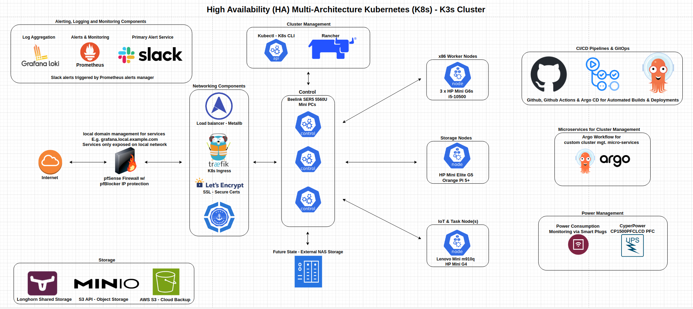

## Kubernetes - K3s cluster for Data & IoT Projects

This repo contains custom code, deployment manifests (3rd party and custom containers), documentation, links to tutorials, notes, installation instructions, and other resources I used to build a high availability Kubernetes cluster using the K3s distro. While this cluster was initially built for professional development/learning purposes and to support my [data platform project](https://github.com/MarkhamLee/finance-productivity-iot-informational-weather-dashboard), it has subsequently become more of platform to support my various side projects, which are usually embedded, IoT or machine learning related. I am also hoping that what I have here will be useful to others, as the initial steps on one’s Kubernetes journey are oft painful.  

*Note: you should use the resources here at your own risk, I guarantee nothing and am just sharing how I built out my setup/what worked for me.* 

### General approach, relevant technologies, etc. 

Design wise, I took the approach of *"how would I build out something to support a minimally viable product or proof of concept for an edge computing related project at work?"*. In other words, aspects of this may seem over-engineered for home use but that is by design and to ensure that I avoid approaches/habits that won’t translate well to a professional setting. Implementation wise this means: 

* Centralized logging, i.e., centralized service to collect logs from all apps  
* Centralized monitoring for problems, issues, etc., via Prometheus, coupled with alerting capabilities via Prometheus Alerts Manager and Slack. Note: alerts are generated when a problem is detected and when it has been solved.
* CICD inclusive of automated container builds and deployments, centralized source of truth for all cluster configurations, etc. 
* Cloud back-up of the cluster state and all data. 
* Deploying apps in a high availability configuration* 
* High availability hardware configuration, I.e., at least three control nodes 
* Redundant hardware monitoring  
* Shared storage via Longhorn
* Secure certificates/encrypted connections for all services via Cloudflare and Lets Encrypt

**When possible, some apps require the purchase of a license to be deployed in HA configuration and others either don’t support HA or do it poorly, so attempting to deploy HA results in a degraded user experience.*  

TL/DR: I tried/am trying to build something that is as close to production quality as possible. 

#### Recent Updates
* **08/20/2024:** quick a few changes over the last several months, making note of the major ones here:
    * All apps are on-boarded to Argo CD and the manifests and approach for each are described in the deployment files folder, June 29th for the onboarding, August 18th for the documentation. 
    * Updated hardware architecture, switched to using dedicated nodes for control, compute and storage and removed the Raspberry Pis
    * Added pgAdmin and Redis
    * Updated all apps to have node affinities and a labeling/server hiearchy to match:
        * Control nodes have a no schedule taint, with appropriate tolerations added to things that are allowed to be deployed on them
        * agent nodes are broken down as follows:
            * All get the label "k3s_role: agent"
            * There are three agent type labels: x86_worker, storage and x86_tasks
            * There are node_type label of x86_worker that is added to the tasks nodes so they can "help" if the primary x86_worker nodes are over-burdened or unavailable
            * The node affinities are set to heavily favor the most appropriate node, but other nodes can be used as well. Think: 50% weighting for agent_type: x86_worker, but the task and x86_worker nodes both have the node_type of x86_worker weighted at 20% so pods can be deployed to the tasks nodes if the first choice isn't available.

### My Cluster: High Availability, multi-architecture - amd64/x86 and arm64
* **Hardware:** 
    * **Server/control plane nodes:** three "Intel NUC like" **Beelink SER5s running Ryzen 5 5560u processors (6c/12t), 64 GB of RAM and 2 TB of storage**. I got them for around $225.00/each on sale from Amazon (down from around $300). With Geekbench 6 scores around 7k (in my testing), you can think of them as getting about 80% of the performance of an 11th gen desktop i5 while using a fraction of the power. The fans also run quieter than the ones in my 12th Gen Intel NUC, albeit at the cost of higher temperatures.

    **Update 8/20/2024:** After noticing that the Beelinks were running in the 60s-70s and wanting to avoid some of the performance issues that can come with using your control nodes to run longhorn and general compute workloads, I decided to split up my cluster into dedicated nodes for: control, general workloads, and storage. The result has been greater stability, the control plane running in the 40-50 degrees celsius range instead of 60s-70s, and an end to some intermittent issues with Longhorn volumes not attaching, resizing, etc.
    
    I've also decided to remove the Raspberry Pis and replace them with dedicated devices for gathering climate data, and/or by connecting the sensors to micro-controllers; the reasons for this are as follows:
    * Dedicated sensor devices and microcontroller based sensors rarely need much in the way of attention, don't have USB ports that go to sleep every few months, etc.  
    * The software for ingesting the sensor data can now run on any node on the cluster, thus making things "more Kubernetes"; this combined with the above makes the climate monitoring setup significantly more robust.  
    * I can move the under-utilized Pis to other projects

    * **Agent Nodes:** 
        * **x86 Worker Nodes: 3 x HP Mini G6s running Intel i5-10500:** I've become a big fan of trying to find ways to re-use parts I have sitting around gathering dust, and giving a second life to capable hardware that might otherwise end up as e-waste. I picked one up used on Amazon for about the price of the Beelinks and got a device that runs a replaceable desktop CPU, runs 15-20 degrees cooler, can support two M2 NVME drives AND an SSD and is a little faster than the Beelinks. I'm also in the process of procuring HP Flex IO devices to upgrade the networking to 2.5Gbe 
        
        * **Storage Nodes:** the original plan was to use two HP G5 Minis as the networking can be upgraded to 2.5Gbe, but since I had Orange Pi 5+ that wasn't being used I went with one G5 and one Orange Pi 5+ since the latter has dual 2.5Gbe. Given the G5 can support two M2s and an SSD, two G5s is a better approach, but this works for now. 

        * **IoT/Task Nodes:** I picked up a Lenovo m910Q on eBay for $30.00 that didn't have a CPU, Wi-FI card, RAM or a HDD because it could run the 7th Gen Intel CPU I had in an old gaming machine with a damaged motherboard. Once I got it up and running I added it into the cluster, set the node labeling so it primarily runs IoT and ETL related workloads and it has run flawlessly. I later picked up an HP G4 (similar situation, but it had a CPU) and have it running in a similar capacity.  

    **Future Plans:** 
        * add a NAS that will primarily be used for home storage and back-up so we don't have to use cloud services, but attach it to the K3s cluster as well for back-ups for running MinIO separately from Longhorn storage.
        * Use something like an N100 SBC or maybe even Rockchip 3588 compute modules to run cluster apps: Cert Manager, Traefik, etc.,      
        
    * **Power Management:** 
        * **CyberPower UPS device:** I have a Rasberry Pi 4B (not part of the cluster) running [Network UPS Tools - NUT](https://networkupstools.org/), which allows it to monitor the state of UPS devices connected to it via USB. I then have a container running on the cluster that can query NUT to grab the latest UPS data and then write it to InfluxDB. You can take a look at the code for the monitoring container [here](https://github.com/MarkhamLee/internet-and-iot-data-platform/tree/main/IoT/cyberpowerpc_pfc1500_ups).  
        * **Kasa Smart Plugs:** monitored via the [Python Kasa library](https://github.com/python-kasa/python-kasa), this allows me to track how much power my *"Homelab Devices"* are using.
        * **Zigbee Based Smart Plugs:** these devices serve a dual purpose: as not only do they provide real time power consumption data, but they also serve as Zigbee routers that augment the Zigbee network.
    * **Future state(s):** dedicated storage nodes that will just run Longhorn and MinIO 
    * All of the nodes are running Ubuntu 22.04, the Orange Pi 5+ is running a community built [Ubuntu 24.04 server distro](https://github.com/Joshua-Riek/ubuntu-rockchip) made especially for Rockchip 3588 devices.  

* **CICD - DevOps**
 * **Argo CD: ** is used to manage all configs, deployment manifests, etc., used for general setup in addition to deploying 3rd party and custom apps on the cluster. I have a separate repo that just contains configs and manifests, whenever an update is made to those files the application is re-deployed. 

* I use the **Kube-Prometheus-Stack** to monitor the cluster and **Prometheus Alerts Manager** integrated with Slack to send alerts. E.g., if a node goes down or a service stops running, I get an alert sent to my phone via Slack 

* **GitHub Actions:** automates the building of Docker images, whenever relevant code is pushed to GitHub, multi-architecture (amd64/x86, arm64) images are built and then pushed to Docker Hub.  

* **Custom code/containers:** are used to monitor/manage a variety of functions 

    * **GitHub Actions Data:** keeping track of how many builds there have been, the status of the most recent build, etc. 

    * **GitHub dependabot security alerts** these containers check the GitHub API for security alerts on an hourly basis, and then alert me via Slack if any security issues are detected. 

    * **Monitor Power Consumption:** pull cluster related power consumption data from smart plugs for display in a Grafana dashboard. 

    * **Hardware Telemetry**: monitor each of the node's operating temperatures, in addition to providing data on CPU and RAM utilization as the data provided within K3s is often higher/based on the maximum compute resources the currently running pods *"could"* use. 

    * **Infrastructure as Code:** except for Argo CD and GitHub Actions configs/manifests, the configuration, manifest, et, al files in this repo are examples (tested examples) as the files that are used to maintain the cluster are in a separate repo. The reason for this is that they sometimes contain information that isn’t per se a secret, but I may not want to share publicly. E.g., the private domain I use for all the secure certificates the cluster uses. 

#### Key Software
* I use **Rancher** to manage the cluster, as a front-end to Longhorn and Prometheus monitoring and to do quick and dirty deployments where appropriate. 

* I use **Longhorn** to aggregate the hard drives on each of the control nodes into a shared pool of storage that the entire cluster can use. Longhorn reserves about 2/3rds of the total storage on each device for shared storage.  

* MinIO is used as an S3 API compatible object store 

* **Argo Workflow** for managing custom code/containers used to manage the service. E.g., the Slack service, and containers used for things like pulling DevOps data from the GitHub API. 

* I use **AWS S3** to back-up both Longhorn storage and Rancher.  

* I use the **Grafana-Loki stack** for log aggregation; it is analogous to using CloudWatch in AWS to collect all of your logging data. 

* I use the **Kube-Prometheus-Stack** to monitor the cluster and **Prometheus Alerts Manager** integrated with Slack to send alerts.  

* **Kubectl** to deploy things from the command line, manage namespaces, etc. 

* I use **Letsencrypt.org certs + Cloudflare and a publicly available domain name** to secure the cluster and ensure all connections are encrypted/secure. I.e., avoid any browser errors from using self-signed certs. I use **Certs-Manager** to manage the secure certificates. 

* I use **Traefik** for the ingress and **Metallb** for the load balancer  

* I'm running a custom router with **pfSense** as the firewall software, aside from the obvious I also use this to create custom local domains for each service, e.g., grafana.local.example.com. I also use Letsencrypt.org certificates to encrypt the connection for the web UI. pfSense is also configured to send alerts via Slack and to make firewall data available via Prometheus and Telegraf. [Setup instructions pending for data export] 

### Future Items 
* Automated, graceful cluster shutdown in response to a power outage, i.e., when the UPS is activated, a graceful shutdown is initiated to avoid some of the nasty storage issues that from abrupt shutdowns.  
* Explore options for making USB devices available over the network, so that the software for a USB device or sensor can just run on the cluster and isn't tied to a specific piece of hardware:  

    * [Project Akri](https://github.com/project-akri/akri), it allows you to add the USB devices attached to your various nodes as network resources available to your entire cluster 

    * Network devices that you can plug a USB device into and make them available over the local network  

    * Serial over TCP, effectively streaming a USB connection from a source device to the cluster  

* Either move the motherboards in the Beelink SER5 nodes into a shared enclosure of some sort and/or upgrade the fans to better control temperatures.  

* Continue to add to/extend the current automation capabilities:  

    * Extend the Ansible playbook I used to setup the cluster so that it goes beyond basic setup, and includes installing the "standard" apps I would want installed on a cluster 

    * Use some combination of Ansible, Argo CD and potentially Flux to automate sys admin type tasks. 

### Acknowledgements & References: 
  
I wouldn't have made it far enough to be able to know enough to share with others if it weren't for likes of [Techno Tim, follow him on YouTube](https://www.youtube.com/@TechnoTim/videos), after finding his channel I started building and tearing down clusters, giddy over being able to get the basics setup in a few minutes as opposed to the not so fun time I was having prior.
