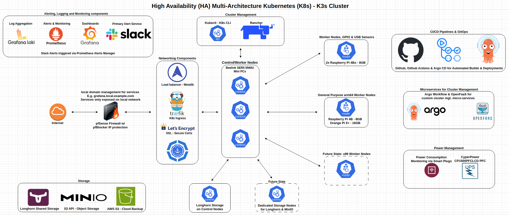

# Kubernetes - K3s cluster for Data & IoT Projects

This repo contains deployment manifests (3rd party and custom containers), documentation, links to tutorials, notes, installation instructions, and other resources I used to build a high availability Kubernetes cluster using the K3s distro. I built this cluster to support my [Productivity, Home IoT, Weather, et al project](https://github.com/MarkhamLee/productivity-music-stocks-weather-IoT-dashboard) in addition to some other things I'm working on. While I knew this would be a project in of itself I wasn't planning on creating a separate repo for it, instead, I was just going to drop a short .md file describing the cluster into the repos for the projects it was supporting. However, afer spending more time on the cluster than its related coding projects, editing 100s of lines of yaml, taking pages of notes, mapping out a CI/CD pipeline, etc., I decided to create this repo if for no other reason than to help others (and my future self) avoid some frustration when standing up Kubernetes clusters. 

*Note: it goes without saying that you should use anything here at your own risk, I guarantee nothing and am just sharing how I built out my setup/what worked for me.*

### General approach, relevant technologies, etc. 

* Everything here is based on building out a high availability cluster, i.e., one with at least three server nodes and deploying three pods (when possible or needed) for each workload. 
* I built everything on devices running Ubuntu, which implies that everything here "should" work on any debian distro and on Linux in general. Outside of that, just know that you'll probably run into some issues. 
* I took the approach of *"how would I build out something to support a minimally viable product or proof of concept for an edge deployment/project at work?"*. Meaning: cloud back-up, shared storage, secure certificates/encrypted connections, CI/CD for custom code, etc. AKA a purposely over-engineered homelab cluster. *E.g., Grafana doesn't need to be HA when it's just me using it, but I did it anyway* TL/DR: I tried/am trying to build something that might not get quite to the level of "production production"*, but should be close. 

### My Cluster: High Availability, multi-architecture - amd64/x86 and arm64
* **Hardware:** 
    * **Server/control plane nodes:** three "Intel NUC like" **Beelink SER5s running Ryzen 5 5560u processors (6c/12t), 64 GB of RAM and 2 TB of storage**. I got them for around $225.00/each on sale from Amazon (down from around $300). With Geekbench 6 scores around 7k (in my testing), you can think of them as getting about 80% of the performance of an 11th gen desktop i5 while using a fraction of the power. The fans also run quieter than the ones in my 12th Gen Intel NUC, albeit at the cost of higher temperatures. 
    * **Agent - Specialized Nodes:** 
        * 2 x Raspberry Pi 4B 8GB used for collecting climate data around my house, I had originaly put *"no schedule"* taints on these devices, but given how little resources the sensors used and the fact that nearly all of my containers/workloads are multi-architecture, I removed it so they can serve as general worker nodes as well. I'm planning on shifting all climate data collection to ESP32s and Raspberry Pi Picos, so I may move these nodes over to a test cluster in the next month or so. 
        * A Raspberry Pi 4B 8GB and an Orange Pi 5 plus (16 GB model) as general purpose arm64 worker nodes. The Orange Pi is running my MQTT broker, several IoT related containers for monitoring smart devices in addition to ETL workloads and the CPU usage rarely crosses 5%. 
    * **Power Management**
        * **CyberPower UPS device**, currently the monitoring is very limited as it can only send telemetry data to one computer via USB, and that data can only be checked/monitored via terminal. An item on "the list" is to build the capability to collect the data, write it to InfluxDB and then share the "graceful shutdown" signal from the USB with all the nodes in the cluster. 
        * **Kasa Smart Plugs:** monitored via the [Python Kasa library](https://github.com/python-kasa/python-kasa), this allows me to track how much power all of my *"Homelab Devices"*.
    * **Future state(s):** dedicated storage nodes that will just run Longhorn and MinIO 
    * All of the nodes are running Ubuntu 22.04, the Orange Pi 5+ is running a community [Ubuntu 22.04 distro](https://github.com/Joshua-Riek/ubuntu-rockchip) made especially for Rockchip 3588 devices.  
* **Software:**
    * I use **Rancher** to manage the cluster, as a front-end to Longhorn and Prometheus monitoring and to do quick and dirty deployments where appropriate.
    * I use **Longhorn** to aggregate the hard drives on each of the control nodes into a shared pool of storage that the entire cluster can use. Longhorn reserves about 2/3rds of the total storage on each device for shared storage. 
    * MinIO is used as an S3 API compatible object store
    * **CI/CD is via GitHub & GitHub actions**, this automates the building of Docker images and whenever relevant code is pushed to GitHub. The images are all dual architecture (when appropriate) and are pushed to Docker Hub, where the cluster can pick them up and redeploy them. Argo CD is still being tested, but will be used for keeping apps up to date. 
    * **Argo Workflow and OpenFaaS** are used for managing custom code/containers used to manage the service. E.g., the Slack service.
    * I use **AWS S3** to back-up both Longhorn storage and Rancher. 
    * I use the **Grafana-Loki stack** for log aggregation
    * I use the **Kube-Prometheus-Stack** to monitor the cluster and **Prometheus Alerts Manager** integrated with Slack to send alerts. 
    * **Kubectl** to deploy things from the command line, manage namespaces, etc.
    * I use **Letsencrypt.org certs + Cloudflare and a publically available domain name** to secure the cluster and ensure all connections are encrypted/secure. I.e., avoid any browser errors from using self-signed certs. I use **Certs-Manager** to manage the secure certificates.
    * I use **Traefik** for the ingress and **metallb** for the load balancer 
    * I'm running a custom router with **pfSense** as the firewall software, aside from the obvious I also use this to create custom local domains for each service. Think: grafana.local.example.com. I also use Letsencrypt.org certificates to encrypt the connection for the web UI. pfSense is also configured to send alerts via Slack and to make firewall data available via Prometheus and Telegraf. [Setup instructions pending for data export] 

### Recent Updates

* **02/16/2024:** added Github Actions files/configurations so that whenver new code is pushed to Github, the Docker images will be rebuilt and then pushed to GitHub. When appropriate containers are built for both amd64/x86 and arm64 so they're able to run any any node in the cluster. Next step is to automate redeploying the services running on k3s in response to container updates.
* **02/10/2024:** added an Orange Pi 5+ (boots Ubuntu from NVME) as a worker node, currently using it run several IoT and ETL related workloads.

### Future Items 
* Currently refining the deployment of **Argo CD** for use in managing CI/CD pipelines, particularly around applications deployed to the cluster. 
* Automated, graceful cluster shutdown in response to a power outage, i.e., when the UPS is activated, graceful shutdown to avoid some of the nasty storage issues that from abrubt shutdowns. 
* Add more arm64 agent nodes and so that the current control nodes can be control nodes only, as opposed to their current configuration as control/worker nodes.
* Add general purpose low power ARM64 agent/worker nodes, Orange pi 5+ or similar devices equipped with a Rockchip 3588 System on a Chip(SOC) [Currently Testing]
* Add two (or more) nodes that are solely dedicated to storage via Longhorn and MinIO
* Experiment with various options for making USB devices available over the network, so that the software for a USB device or sensor can just run on the cluster and isn't tied to a specific piece of hardware: 
    * [Project Akri](https://github.com/project-akri/akri), it allows you to add the USB devices attached to your various nodes as network resources available to your entire cluster
    * Network devices that you can plug a USB device into and make them available over the local network 
    * Serial over TCP, basically stream a USB connecting from a source device to the cluster 
* Either move the motherboards in the Beelinks into a shared enclosure of some sort and/or upgrade the fans in order to better control temperatures. 
* Add automation for both setup and day to day management:
    * Extend the Ansible playbook I use to setup the cluster so that it goes beyond basic setup, and includes installing the "standard" apps I would want installed on a cluster
    * Use some combination of Ansible, Argo CD and potentially Flux to automate the day to day sys admin type tasks.

### Acknowledgements & References: 
  
* I wouldn't have made it far enough to be able to know enough to share with others if it weren't for likes of [Techno Tim, follow him on YouTube](https://www.youtube.com/@TechnoTim/videos), after finding his channel I started building and tearing down clusters, giddy over being able to get the basics setup in a few minutes as opposed to the not so fun time I was having prior.
