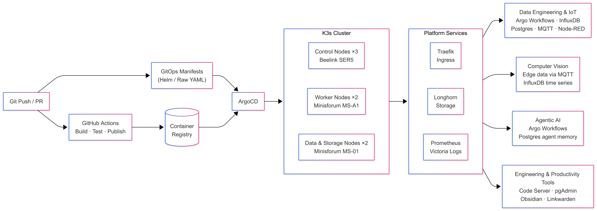

## Kubernetes (K3s) Powered Private Cloud

Self-hosted K3s cluster that is the shared services platform for active development projects in data engineering, computer vision, agentic AI and IoT, in addition to hosting productivity and dev tools (Obsidian LiveSync, Linkwarden, pgAdmin, Code Server). The cluster is managed declaratively with Git, application delivery is managed via ArgoCD, distributed storage is provided by Longhorn and centralized observability by Prometheus and Victoria Logs. 

| Use Cases                                    | Supporting Services & Technologies                                                                                        |
| -------------------------------------------- | ------------------------------------------------------------------------------------------------------------------------- |
| Data Engineering, IoT                        | ArgoCD for GitOps, Argo Workflow for ETL & task orchestration, Influx & Postgres for data stores, MQTT & Node-RED for IoT |
| Computer Vision                              | MQTT & Node-RED for collecting data at the edge, InfluxDB for time series data                                            |
| Agentic AI                                   | Argo Workflows for scheduling LLM agents, Postgres for agent memory                                                       |
| Engineering tools                            | Code Server, pgAdmin, phpMyAdmin                                                                                          |
| Personal productivity & knowledge management | Obsidian LiveSync, LinkWarden, Paperless-ngx, Invoice Ninja                                                               |

This repository is the operational record of the platform: architecture documentation, reference deployment configs (live IaC is maintained in a separate private repo), maintenance runbooks, troubleshooting notes, and the custom container code used for hardware monitoring. It's organized so that rebuilding the cluster from scratch, diagnosing unfamiliar issues, or onboarding a new workload starts here.

## Delivery Model

### The Apps I'm currently self-hosting 

The screen above was created with the Homepage App, which you can find [here](https://github.com/gethomepage/homepage).

The above doesn't have each and every app, but these are the primary ones and/or the ones that are worth while tracking via Homepage. 

## Repository Guide

| Section | Contents |
|---|---|
| `docs/architecture/` | Platform design, node roles, networking, storage |
| `docs/bootstrap/` | Cluster provisioning (Rancher-native; historical Ansible notes) |
| `runbook/` | Operational procedures, maintenance tasks, incident notes |
| `platform-services/` | Reference deployment configs for cluster infrastructure |
| `workloads/` | Reference deployment configs for 3rd party apps and custom workloads |
| `hardware_monitoring/` | Custom container code for node and device monitoring |
| `dashboards/` | Grafana dashboard exports |

### Acknowledgements & References: 
  
I wouldn't have made it far enough to be able to know enough to share with others if it weren't for likes of [Techno Tim, follow him on YouTube](https://www.youtube.com/@TechnoTim/videos), his was the first tutorial I came accross that didn't make Kubernetes sound clear as mud. 