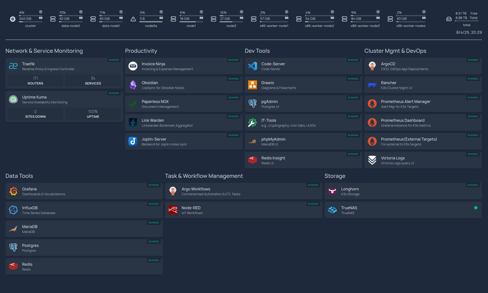
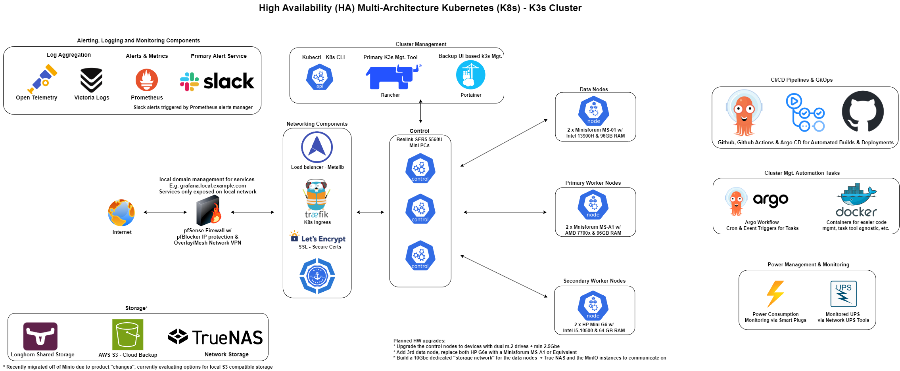

## Kubernetes Powered Private Cloud/Home Lab

This project started out as a small three node cluster I used to run a small number of 3rd party applications and the custom containers for my [data ingestion project](https://github.com/MarkhamLee/finance-productivity-iot-informational-weather-dashboard), strengthening my DevOps skills and learning Kubernetes. It has since morphed into a veritable *private cloud* that hosts a wide variety of apps I used in my day to day life in addition to continuing to serve its original purpose of running containers for my various data ingestion and other projects.  

**The apps I'm currently self-hosting** 

The screen above was created with the Homepage App, which you can find [here](https://github.com/gethomepage/homepage).

The above doesn't have each and every app, but these are the primary ones and/or the ones that are worth while tracking via Homepage. 

This repo contains the documentation, deployment manifests (3rd party and custom containers), tutorials, notes and custom code I used to build and maintain this cluster. I'm hoping that what I have here will be useful to others, as the initial steps on one’s Kubernetes journey are oft painful.  

*Note: you should use the resources here at your own risk, I guarantee nothing and am just sharing how I built out my setup/what worked for me.* 

 ***Current architecture as of July 16, 2025***

### General approach, relevant technologies, etc. 

When deploying 3rd party apps or the general K3s infrastructure I try to follow each app's recommended settings for a production deployment, meaning: number of replicas, nodes, security configuration/practices, etc. I try to make sure that all custom code is built to the same level, and has enough monitoring, redundancy, etc., to ensure I don't miss problems and there is rarely any downtime. The TL/DR read here is that it's "reasonably over-engineered", and while that results in more work in the short-term, it means far, far, fewer headaches in the long-term. 

Implementation wise this means: 

* Cloud & NAS back-up of all app data, management tools tools like Rancher, etc.
* IAC - all deployment configuration, manifests, helm values.yaml, etc., etc., are all stored in thier private GitHub repo, cluster updates are made via updating the YAML in the repo, and those changes are then applied to the cluster via ArgoCD. 
* Whether it's a disaster, hardware upgrade or just wanting a clean start, the above two bullets mean that rebuilding the cluster or building a duplicate one is relatively simple. 
* Centralized monitoring for problems, issues, etc., via Prometheus, coupled with alerting capabilities via Prometheus Alerts Manager and Slack. Note: alerts are generated when a problem is detected and when it has been solved.
* Metric and log data is backed-up outside the cluster to make it easier to diagnost problems in the event of a disaster.
* Securing service access via a mesh network style VPN, so I can manage the cluster and use the services on it when I'm not on my home network, without having to open ports to the public/externally. 
* CICD inclusive of automated container builds and deployments, centralized source of truth for all cluster configurations, etc. 
* Deploying apps in a high availability configuration* 
* High availability hardware configuration
* Shared storage via Longhorn
* Secure certificates/encrypted connections for all services via Cloudflare and Lets Encrypt

**When possible, some apps require the purchase of a license to be deployed in HA configuration and others either don’t support HA or do it poorly, so attempting to deploy HA results in a degraded user experience.*  

#### Recent Updates

**06/27/2025:** made a significant number of changes since the last update with respect to hardware, storage, cluster management and software, will just summarize the high level items, you can read a more detailed version [here](/detailed_updates/current_updates.md)

* **Hardware Changes:** replaced most of the cluster's hardware this past January with the goal of makings more dependable and performant: 
    * Storage nodes replaced with two Minisforum MS-O1 (13900H CPU with 96 GB of DDR5 RAM) designated as data nodes, meaning they're used for shared storage and are the preferred nodes for deploying databases and other data intensive applications: 
        * Longhorn storage runs on these devices and they each have a dedicated 4 TB drive for this purpose. 
        * The node affinity for applications like CouchDB, InfluxDB, Joplin-Server, MariaDB, Postgres, etc., prefer these nodes.
        * I picked these as they have a small footprint, fast processors, and have dual 2.5Gbe in addition to dual 10Gbe SFP+ fiber connections. In a future state they will connect to K3s via the 2.5Gbe ports and talk to each other via the 10Gb ports for data replication + connecting to external storage, but for right now are just using the 2.5Gbe connections. 
        * I added two Minisforum MS-A1s, each with an AMD 7700X processor and 96GB of DDR5 RAM as general purpose worker nodes. 
    * I've also added TrueNAS instance that while not part of the cluster, provides back-up storage/storage redundancy and is occassionally used to sandbox apps before they're added to K3s.
* **Software changes:** have mostly been around deploying more apps and utilizing the data nodes as described above, but there have been some changes related to the software used to manage & monitor the cluster:
    * I'm running an external Portainer instance that I use to "co-manage" the cluster along with Rancher, I rarely use it, it's just a back-up in case I have issues with Rancher. E.g., accidentally letting certificates expire. 
    * I still use Prometheus only it's now deployed via ArgoCD instead of the Prometheus monitoring stack available to deploy via the Rancher UI. It's a more streamlined and less resource intensive implementation.
    * I no longer use the Loki-Stack for logging and have switched to Victoria Logs and Open Telemetry, additionally Victoria logs is used to gather logs from devices/systems outside of the cluster.
    * MinIO is available via TrueNAS but I'm experimenting with replacing it with Garage.

## My Cluster: High Availability & Fast

### Hardware

A more detailed overview of the hardawre is [here](/hardware_overview/). All of the nodes currently run Ubuntu 22.04, which will be upgraded to 24.x by the end of the year.

* **Control plane nodes:** three "Intel NUC like" **Beelink SER5s running Ryzen 5 5560u processors (6c/12t), 64 GB of RAM and 2 TB of storage**. In a prior iteration of the cluster these nodes ran everything, but I changed them to be control node only because they were regularly overheating. In their current role they run just fine. Future plan is to replace them with devices capable of 2.5Gb networking. 

* **Agent Nodes:** are split into two groups: data nodes that manage storage and run databases/data intensive apps and worker nodes that run everything else, these are their stories... 

    * **Data Nodes - 2 x Minisforum MS-01 w/ 13900H CPUs & 96GB of DDR5 RAM:** these nodes run all data intensive apps as well as run Longhorn Storage. Data intensive apps (like Postgres) have a 70/30 node affinity to prefer these nodes. I choose the devices for this purpose due to their CPU speed as well as them having dual 10Gb SFP+ ports, which I intend to utilize for a dedicated storage network in the near future. Another future plan is to add a 3rd data node that can step in for Longhorn duty if one of the data nodes goes down or needs maintenance. 

    * **Primary Worker Nodes - 2 x Minisforum MS-A1 w/ AMD 7700x CPUs & 96GB of DDR5 RAM:** lower cost and similar compute performance as the MS-01 13900Hs in their current configuration but they only have dual 2.Gbe networking. However, the CPU is replaceable, which when coupled with the lower cost makes them great general purpose compute workhorses. Similar to the data nodes they receive general purpose workloads via a 70/30 node affinity. Future plan is to add a 3rd general work node of similar ability. 

    * **Secondary worker nodes: 2 x HP Mini G6s running Intel i5-10500:** these are holdovers from the hardware upgrades I did back in January, I left them in as a security blanket since I replaced five of the "old" nodes in a single afternoon. However, since they never gave me any trouble, run cool and sip power I left them in. 

**Power Management:** 

* **CyberPower UPS device:** I have Rasberry Pi 4Bs (not part of the cluster) running [Network UPS Tools - NUT](https://networkupstools.org/) that are connected directly to the UPS via USB, this gives them teh ability to monitor the state of the UPS devices in real time.  I then have a container running on the cluster that can query NUT to grab the latest UPS data and then write it to InfluxDB. You can take a look at the code for the monitoring container [here](https://github.com/MarkhamLee/internet-and-iot-data-platform/tree/main/IoT/cyberpowerpc_pfc1500_ups).  

* **Kasa Smart Plugs:** monitored via the [Python Kasa library](https://github.com/python-kasa/python-kasa), this allows me to track how much power my devices are using.
    
* **Zigbee Based Smart Plugs:** these devices serve a dual purpose: as not only do they provide realtime power monitoring, but they also serve as routers and signal boosters for the battery powered Zigbee devices I use for climate monitoring.

### CICD - DevOps

**Deployment, Management & Monitoring**

 * **Argo CD: ** is used to manage all configs, deployment manifests, etc., for deploying 3rd party and custom apps to the cluster; I have a separate repo that just contains configs and manifests, whenever an update is made to those files and checked into Git, it's detected by ArgoCD and the app is updated.

* **Infrastructure as Code:** continuing from the above, all the deployment YAML/IAC for all the apps in the cluster are stored in a private GitHub repo. This includes umbrella charts and values.yaml files for each of the apps deployed via Helm, custom deployment manifests for my custom apps or 3rd party apps and anything else used to deploy apps to or modify the cluster. 

* **GitHub Actions:** automates the building of Docker images, whenever relevant code is pushed to GitHub, multi-architecture (amd64/x86, arm64) images are built and then pushed to Docker Hub. 

* I use **Prometheus** and **Victoria Logs** to monitor the cluster's apps hardware and **Prometheus Alerts Manager** integrated with Slack to send alerts. E.g., if a node goes down or a service stops running.

* I use **Rancher** to manage the cluster and as a front-end to Longhorn and Prometheus monitoring.

* **Monitor Power Consumption:** pull cluster related power consumption data from smart plugs for display in a Grafana dashboard. 

* **Hardware Telemetry**: monitor each of the node's operating temperatures, in addition to providing data on CPU and RAM utilization as the data provided within K3s is often higher/based on the maximum compute resources the currently running pods *"could"* use.

* Future items:
    * Alerts for when 3rd party apps are updated
    * Automated redeployments for when custom apps are updated

### Acknowledgements & References: 
  
I wouldn't have made it far enough to be able to know enough to share with others if it weren't for likes of [Techno Tim, follow him on YouTube](https://www.youtube.com/@TechnoTim/videos), his was the first tutorial I came accross that didn't make Kubernetes sound clear as mud AND enabled me to a proper/not full of security holes cluster.
