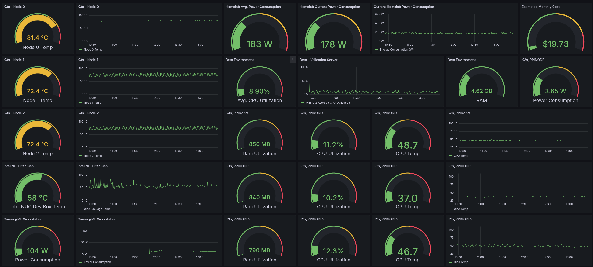
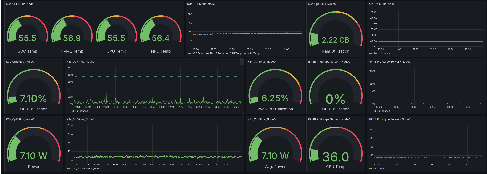

### Hardware Dashboard

This [Grafana](https://grafana.com/) dashboard is used to monitor my "homelab" devices with respect to CPU & RAM utilization, temperatures, overall power consumption + power consumption of my Gaming PC. The reason for the extra monitoring is that my Prometheus setup does not monitor temperatures, CPU and RAM utilization are more reflective of reserved or potential use and to monitor overall power consumption. Note: the total power consumption number does not include the gaming PC or the Intel NUC I do most of my dev work on.  

#### Technical Implementation Details 

* The dashboards were built using Grafana, which is pulling time series data from InfluxDB. 
* Hardware data is pulled via custom code leveraging the [psutil library](https://pypi.org/project/psutil/) running on each device in a Docker container; the containers are deployed/managed via the k3s cluster, ditto for alerting if the container stops running. The code for HW monitor is based on a separate project I have for hardware monitoring that you can find [here](https://github.com/MarkhamLee/HardwareMonitoring). 
* I use MQTT (low power usage vs REST requests + two-way communication) to send data from the devices to InfluxDB. 
* I have custom code built around the [python-kasa](https://github.com/python-kasa/python-kasa) library that pulls in the power consumption data, which can be found [here](https://github.com/MarkhamLee/finance-productivity-iot-informational-weather-dashboard/tree/main/IoT/kasa_devices/plugs). 
* Additional power data is provided via smart plugs that communicate via the Zigbee protocol  

#### Hardware & Devices 
* All 7 K3s Nodes: monitoring CPU temps for all, CPU & RAM utilization for the single board computers (E.g., Raspberry Pis) 

* **Total Power Consumption for the following:**  
    * K3s Nodes 
    * Beta Server (Beelink N95 Mini PC) 
    * Firewall Server (N100 Mini PC) 
    * All network switches: 16 port and an 8 port, both with POE 
    * Primary dev box: 12th Gen Intel NUC 
    * Music Server: 11th Gen Intel NUC running [Roon Optimized Core Kit](https://help.roonlabs.com/portal/en/kb/articles/roon-optimized-core-kit#So_what_is_Roon_Optimized_Core_Kit_ROCK_then), Roon's music server software that allows you to turn an Intel NUC (it will run on nearly any x86 machine, but your mileage will vary if it is not an Intel NUC) into a dedicated network appliance for music. 
    * Gigabit broadband modem  

* For context: my primary gaming PC with an 12th Gen 12700k + a 3090TI pulls about 130 watts at idle, and my 11th Gen i5/3060TI desktop pulls about 145 watts at idle. Meaning: Six Intel NUC style Mini PCs + four single board computers, 7 of which are active parts of a Kubernetes cluster, only pull about 30-40 more watts than a gaming desktop at idle. 

* Cost is calculated based on average kilowatt hours X average cost of electricity in Seattle + 10%. 

* Hardware data for a machine I use as a beta environment, e.g., validating that something works for a few weeks before I re-deploy it on the K3S cluster. 

* A Raspberry Pi 4B that I use as a “prototyping” server, which in many cases is no different than the above, however, due its size it might be easier to deploy in a certain physical space e.g., placing it near my UPS as a I tested various approaches to pulling data off of and managing that device. 