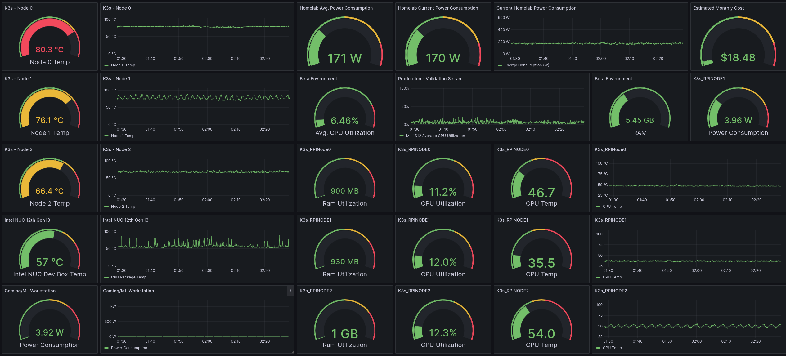
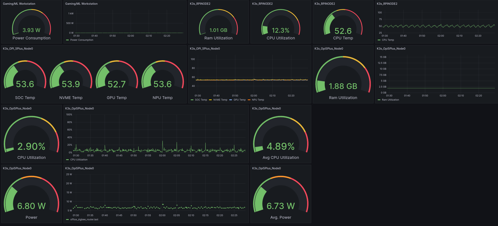

### Hardware Dashboard

This is used to monitor all of my "homelab" devices + power consumption of my Gaming PC. The reason for the extra monitoring is that my prometheus setup doesn't monitor temps and to give me insight into actual CPU and RAM usage vs the "potential" numbers shown via k8s monitoring. 

#### Technical Implementation Details 

* All of these dashboards were built using Grafana, which is pulling time series data from InfluxDB.
* Hardware data is pulled via custom code leveraging the [psutil library](https://pypi.org/project/psutil/) running on each device in a Docker container; the containers are deploye/managed via the k3s cluster, ditto for alerting if the container stops running. I have a separate project around hardware monitoring that you can find [here](https://github.com/MarkhamLee/HardwareMonitoring).
* I use MQTT (low power usage vs REST requests + two way communication) to send data from the devices to InfluxDB.
* I have custom code built around the [python-kasa](https://github.com/python-kasa/python-kasa) library that pulls in the power consumption data, which can be found [here](https://github.com/MarkhamLee/finance-productivity-iot-informational-weather-dashboard/tree/main/IoT/kasa_devices/plugs).
* Additional power data is provided via smart plugs that communicate via the Zigbee protocol.

* All 7 K3s Nodes: monitoring CPU temps for all, CPU & RAM utilization for the single board computers (E.g., Raspberry Pis)
* **Total Power Consumption for the following:** 
    * K3s Nodes
    * Beta Server (Beelink N95 Mini PC)
    * Firewall Server (N100 Mini PC)
    * All network switches: 16 port and an 8 port, both with POE
    * Primary dev box: 12th Gen Intel NUC
    * Music Server: 11th Gen Intel NUC running [Roon Optimized Core Kit](https://help.roonlabs.com/portal/en/kb/articles/roon-optimized-core-kit#So_what_is_Roon_Optimized_Core_Kit_ROCK_then), Roon's music server software that allows you to turn a Intel NUC (nearly any x86 machine, but your mileage will vary if it's not an Intel NUC) into a dedicated network appliance for music.
    * Gigabit broadband modem 
* For context: my primary gaming PC with an 12th Gen 12700k + a 3090TI pulls about 130 watts at idle, and my 11th Gen i5/3060TI desktop pulls about 145 watts at idle. Meaning: Six Intel NUC style Mini PCs + four single board computers, 7 of which are active parts of a Kubernetes cluster, only pull about 30-40 more watts than a gaming desktop.

* Cost is calculated base on average kilowatt hours X average cost of electricity in Seattle + 10%.
* My Gaming PC was "asleep" when this screenshot was taken, so just the cost to have it at idle + the tiny bit of power the PC case temperature sensors I have running on a Raspberry Pi Pico microcontroller uses. 

