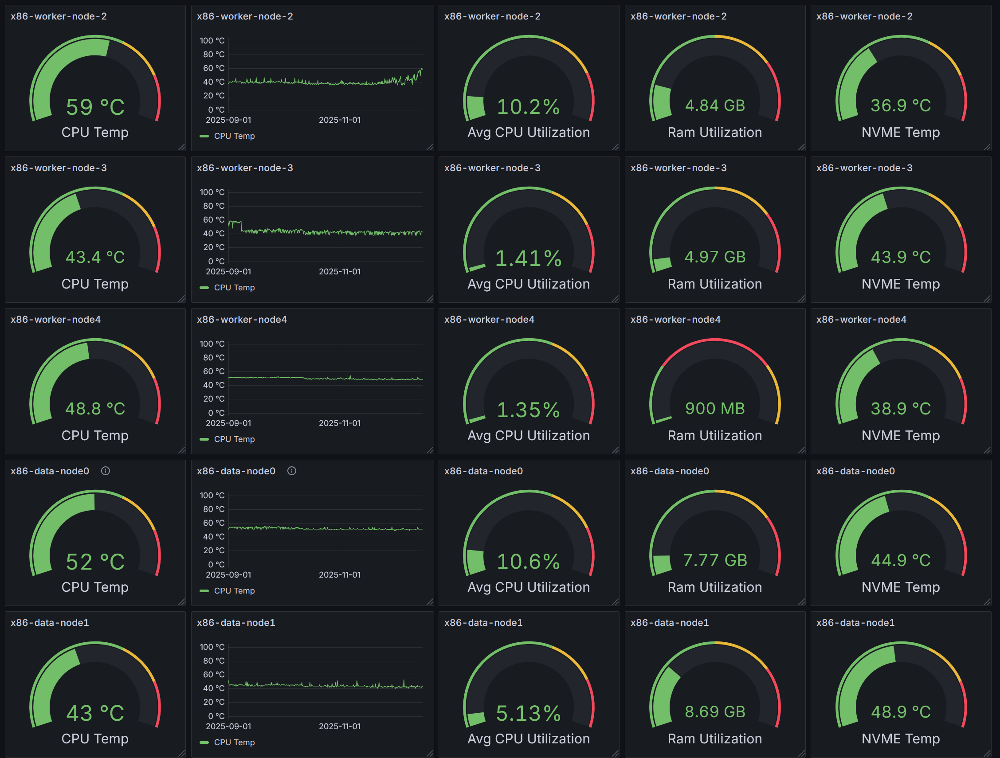

## Hardware Dashboard(s)

A set of hardware focused dashboards has been built to monitor K3s nodes and supporting servers for CPU, memory, temperatures, and power-related metrics. Monitoring data is collected using a combination of open-source tools, Python libraries, and custom code, which is written to InfluxDB and visualized with Grafana.

### Cluster Node Monitoring

This [Grafana](https://grafana.com/) dashboard tracks CPU utilization, memory usage, system temperatures, and NVMe temperatures across cluster nodes. It supplements Prometheus, which does not capture hardware temperature metrics. Data is retained in InfluxDB for 18 months, enabling long-term trend analysis such as identifying nodes that are gradually running hotter and may require cooling improvements. 

Similar dashboards are used for systems in the broader “Private Cloud” that are not part of the K3s cluster (for example, storage servers and network infrastructure).

#### Technical Implementation Detials 

Technical Implementation Details
* Hardware metrics are collected via custom Python code using the psutil library.
* Monitoring containers on K3s nodes are deployed through the standard pipeline: GitHub Actions → Docker Hub → ArgoCD → K3s.
* Non-K3s systems run the same monitoring containers, deployed via Docker Compose and managed with Portainer.
* Containers are built to run as non-root application users and only require read access to the host interfaces and metrics they scrape.
* Source code for the monitoring containers is available [here](../../workloads/custom_containers/hardware_monitoring/readmd.md).
