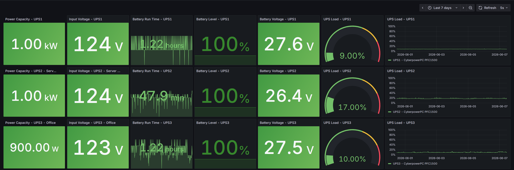

## UPS Monitoring

UPS devices are connected via USB to Raspberry Pi systems running Network UPS Tools (NUT). These Pis expose network endpoints which are queried by monitoring containers running in the cluster to retrieve real-time power, load, and battery data, which is then written to InfluxDB for display via Grafana. Additionally, the monitoring containers provide real time alerting capability via Slack. The [code for monitoring the UPS devices](https://github.com/MarkhamLee/internet-and-iot-data-platform/tree/main/IoT/cyberpowerpc_pfc1500_ups) can be found in the repo that contains the data engineering side of this private cloud.

#### Technical Implementation Details 
* The NUT server on each Raspberry Pi exposes UPS status over the network, and client configurations use dedicated NUT users with read-only permissions for monitoring.
* UPS monitoring integrates with Slack and sends alerts on the following events:
    * Loss of power: notifications are sent every 15 minutes with estimated remaining runtime.
    * Return of power: periodic updates provide battery recharge progress.
    * UPS device coming online.
* The Raspberry Pis are connected via Tailscale, even when on the same local network, enabling:
    * Redundant monitoring and alerting from systems external to the K3s cluster.
    * Deployment flexibility for monitoring infrastructure across remote networks (for example, co-location environments or separate LANs).