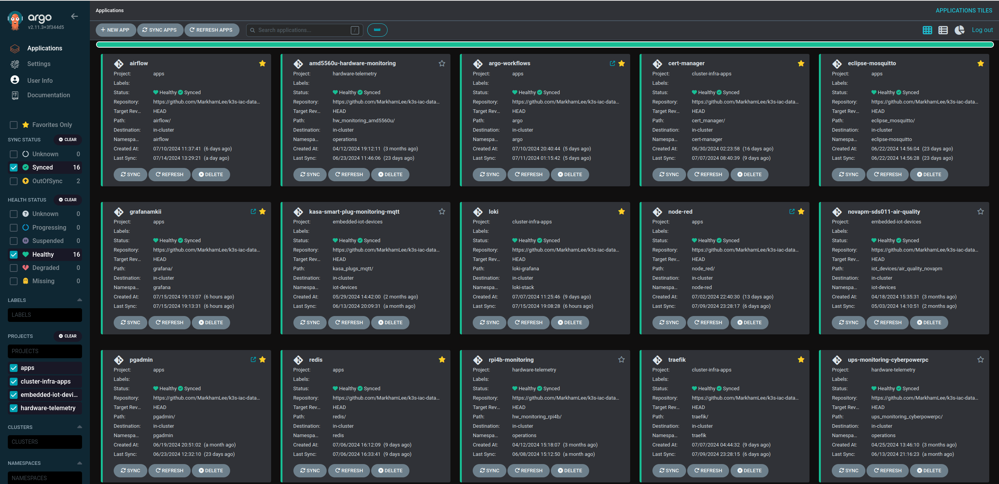
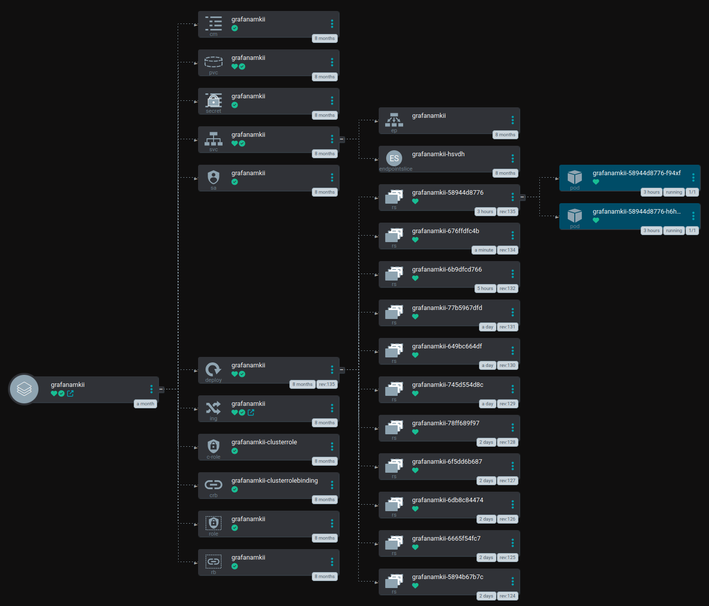

## CI/CD with Argo CD

Installing applications on Kubernetes can be frustrating at times between helm chart variants, 1,000 line yaml files, stumbling upon the wrong or out of date instructions, etc., and that's before you encounter post installation "gotchas" that are rarely mentioned. This folder contains installation instructions, values.yaml files, tips, tricks and "gotchas" for the applications I've deployed on my Kubernetes cluster. I've also included information on the settings, tweaks, etc., you need to change once you've got something deployed in order to keep it running.

#### Prerequisites

These instructions presume you have enough control of your firewall/router/local network to setup domains (i.e., nodered.local.example.com) on your home network in order to support proper ingresses for each service, are using secure certs for your k8s cluster, are using something like Longhorn for distributed/cluster wide storage and have enough hardware to deploy apps as HA if you so choose.

### Deployment Approach

With the exception of Longhorn pretty much everything that's deployed on the cluster is managed via Argo CD



Argo CD continuously compares the state of apps (whether 3rd party of things I built myself) deployed on the cluster vs deployment manifests in a GitHub repo that contains app manifests, Umbrella Charts for helm, values.yaml files, et, al. Application code is kept in a separate repo, following best practices for keeping app/deployment configs and application code separate. 
If an app is changed on the cluster either via a CLI command or via the console/Rancher, Argo CD will "heal" the app and restore to its proper configuration. This forces good habits as I have to commit changes to GitHub before they will be reflected in the cluster, thus making rollbacks and tracking changes significantly easier. 

The first step is to add/configure the app in Argo CD either via the command line (applying a manifest) or configuring it via the UI. I have UI examples in the argocd_cicd_manifests folder. Next, you need to prepare your deployment files, the typical deployment pattern involves an Umbrella Chart and a values.yaml placed in a GitHub repo monitored by Argo CD, when Argo CD is pointed to a the folder containing the two files it then deploys the app to the cluster once it detects a new file/file update. I took this approach so things are more "GitOps" and consistent, and because it seems to reduce the number of gotchas vs using deployment manifests or deploying things from the available charts within Rancher. 

I have examples for each app here, but maintain a separate private repo with the Chart.yaml and values.yaml files to avoid accidental PII leakage.

Example Chart.yaml file - make sure you spell chart with a capital "C", otherwise ArgoCD won't pick it up. 
```
apiVersion: v2
name: airflow
description: Umbrella chart for deploying Airflow
type: application
version: 0.1.0
appVersion: "0.1.0"
dependencies:
  - name: airflow
    version: 18.3.7
    repository: oci://registry-1.docker.io/bitnamicharts
    alias: airflow
    condition: airflow.enabled
```
In the values.yaml file the alias is the top key, so all of the typical values.yaml, well values, have to be shifted to the right. 

IF you're onboarding an existing app to Argo CD, make sure that self-healing and pruning isn't enabled to avoid issues where an existing resource isn't picked up by/synched with Argo CD. If this happens:
  * If you synch the app but don't enable pruning and self-healing, values.yaml updates you make will be deployed but needed but un-synched resources won't get deleted.
  * The issue is probably a naming one that can be fixed by changing the deployment/service annotations within Kubernetes 
  * If the secret doesn't synch you "can" just let Argo CD delete the secret as in nearly all cases a new one will be generated, BUT take that approach at your own risk because YMMV.

You can also deploy via your typical Kubernetes deployment manifest, service definitions, et al, in those cases I just put those files into the folder instead of the umbrella chart + values.yaml file. 

Once deployed you should see a deployment tile like the ones in the screenshot above, clicking the tile should show you something like this:




From here if you wanted to change pod affinities, number of replicas, docker image versions, persistent volume sizes, etc., you would just make those changes to the values.yaml file and then push them to GitHub and ArgoCD will do the rest. Changes to the Helm chart version will redeploy the app as well. 

ArgoCD doesn't currently monitor the app code or docker images for changes, so you'll need to trigger redeployments for those manually, same goes for helm chart updates. 


  


