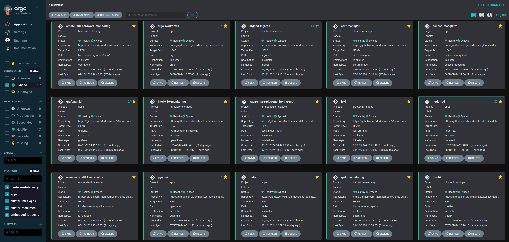

### Deploying Argo CD

I use a fairly basic approach to deploying Argo CD, where I just deploy/make updates from the command line:

```
kubectl apply -n argocd -f https://raw.githubusercontent.com/argoproj/argo-cd/v2.10.0/manifests/ha/install.yaml
```

After the initial deployment you can use Argo CD to manage your Argo CD (Dev Ops Inception), however, I don't plan on trying that until I stand up a beta cluster I can test it on.  

#### The ingress was a bit tricky:
* Create (if it doesn't already exist) a config map file named: "argocd-cmd-params-cm" and then set the parameter: server.insecure: true - this will allow Traefik to handle the secure connection bit. 

Next, use an ingress file like the one in this folder and you should be good to go. Note, I put the ingress file in a GitHub folder and pointed ArgoCD to it, so it will monitor/manage the ingress file. Seemed a good idea given how tricky it can be when using Traefik for your load balancer. 



Not sure why, but I really enjoy these app tiles. 