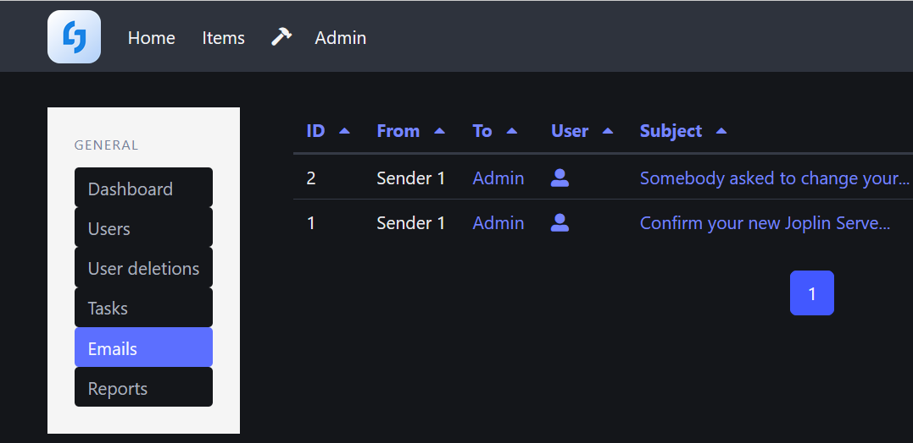

# Deploying Joplin-Server on K3s

This folder contains instructions and a deployment manifest for deploying the backend server for the Joplin note taking app. Once deployed on your K3s cluster and coupled with VPN networking to tunnel back into your home network, you can use the app on your computers and portable devices and back-up your notes to your own private data store that you control. You *"can"* just use a Helm Chart, but I found that problematic in terms of how I wanted to deploy things:

* There was a dependency to use a specific type of Postgres, namely: [CloudNativePG](https://cloudnative-pg.io/), which for the record, I don't have any problems with, but I'm already fairly happy with my Postgres deployment and didn't feel the need to have two of them, migrate what I have, etc. I did attempt to get it to use my deployment but ran into issues as the Chart had a hard dependency on CloudNativePG.
* It pulls in a second "common" chart common for a lot of the Helm charts available from TrueCharts, which is again, not a problem per se, but just adds unneeded complexity. 

As a result of the above I just wrote my own deployment manifest as it was just simpler, easier to maintain, etc. These instructions presume you would be using ArgoCD to deploy it, but you could always deploy it from the command line. 

## A word on Networking

Given that you deploy Joplin-Server as a way to synchronize and backup notes accross devices, it stands to reason that you would be using the mobile apps and/or would want to synch notes when you're not on your home network. In that case, you'll need to take some additional steps beyond setting up an ingress to enable access to Joplin server when on you're not on your home network. However, please be aware that this isn't explicitly neccessary, as the notes are also stored locally, so you could just synch the notes when you're home. However, if you do want to be able to synch away from home:

* You'll need some sort of VPN solution to either integrate with Kubernetes or with your home network. My solution is deployed at the Firewall level and since that Firewall routes traffic to the Ingress, I can synch Joplin away from home. Solutions like WireGuard, Tailscale, Headscale, Netbird or ZeroTier are all potential solutions. Given how sensitive security is, I won't recommend one, but any of those solutions should work. 

## Deployment Instructions 

1) Create a namespace in Kubernetes for Joplin
2) Within the above create secrets to point it to your Postgres instance for the IP, port, user name, password, etc.
3) Go into your Postgres instance and create a table for the Joplin instance to use, and then add that table name as a secret (or you can use a configmap, but update the manifest accordingly) in the namespace you created for Joplin.
4) Edit the values.yaml file in this repo to fit your environment, E.g., Ingress definition, secret names, ports, etc. 
    * The values.yaml has the email sever bits commented out, but if you have an SMTP server available you can fill those in
    * The email server is used to email you things like password notes and other alerts, but if you don't configure it you can still read all the sent emails from within the admin interface.
5) Setup networking, e.g., dns entry for the ingress in your Firewall, your VPN, etc. 
6) Add the values.yaml file to your GitHub repo where you store the IAC for your K3s cluster
7) Go into ArgoCD, crete a new app and point it to the folder where the Joplin values.yaml file is stored. Pick the options around synch or auto-synch per your preferences. 

After that things should deploy just fine, and you'll then be able to download the mobile and/or desktop apps, point them towards your instance and be good to go. For your first login to the backend server app the username is: admin@localhost and the password is admin. You'll need to change the password and change the default email to your own. To change the default email address the system will send you a confirmation link to your email address, if you don't have an email server configured, you can go to the admin page, click the "Emails" tab and use the link in the confirmation email.

