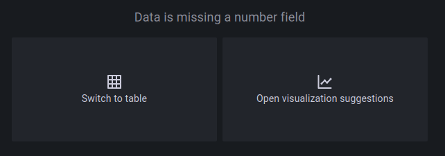

## Loki Stack Installation Instructions

### Prequisites

Loki operates by collecting/grabbing/scraping logs from each node. Meaning: the logs generated by all the pods running on a given node are saved on that node and Loki effectively harvests them. However, Loki will only be able to grab logs from containers that are writing logs to stdout/console. Meaning:

1) For your custom containers you need to make sure that all of your logs are being written to stdout/console. 
2) It's entirely possible that if a 3rd party app's container isn't built properly, you won't be able to catch the logs in Loki. 
3) If your container is logging data but not to stdout, has print statements, etc., you will be able to see the logs and the print statement outputs by going to that pod and selecting 'show logs' from the hamburger menu, but they won't be picked up by Loki. 

Additionally, the Loki Stack uses Promtail to grab the logs from each node. 

You can read more about the Loki stack [here](https://grafana.com/docs/loki/latest/)

### Installation 

**First:** create a namespace, I used loki-stack, but you can use anything you'd like 

Next you have two main options:

#### Option #1 - Deploy via Argo CD

* Use the Chart.yaml and values.yaml file in this folder to deploy the Loki-Stack via Argo CD. The values.yaml is somewhat boiler plate, but keep in mind that you'll need to update the node affinity to match the labels used by your K3s nodes, as mine are heavily customizied to my specific hardware architecture.
* Additionally, the values.yaml file is fairly simple, so if you need more options/want to customize things more would be wise to grab the "official" values.yaml from the helm repo.


#### Option #2 - Deploy via Helm at the Command Line

1) Run the command below to add the helm chart 
```
helm repo add grafana https://grafana.github.io/helm-charts
```
2) Update the helm repo:
~~~
helm repo udpate
~~~

3) Run the command below for the default install (scalable version), make sure to put the name of the namespace you created after the "-n". Keep in mind this will install an instance of Grafana even if you already have it deployed on your cluster, BUT this installs an older version of Grafana that's pre-configured to connect to Loki. I.e., this installs 8.3.5 vs the current version of 10.2.2. I wasn't able to get the newer version to connect to Loki, so I would just run the two different versions, because the older one has issues connecting to InfluxDB. 

```
helm upgrade --install loki grafana/loki-stack -n loki-stack  --set grafana.enabled=true,prometheus.enabled=true,prometheus.alertmanager.persistentVolume.enabled=false,prometheus.server.persistentVolume.enabled=false,loki.persistence.enabled=true,loki.persistence.storageClassName=longhorn,loki.persistence.size=20G
```

#### Post Deployment Setup

Once you have this deployed you can go into Grafana and create logging dashboards by going to create dashboard --> add panel --> log browser  and then you can select the apps or containers you want to monitor. Make sure you're selecting at the highest level, e.g., apps or containers, as pods can be ephemeral and you might not have data when you update an image, redeploy something, etc. Once you select something click "show logs", and you'll either see data right away or will see a screen that looks similar to the below:



If you see the above it doesn't mean your query failed, it just means it's not the usual numerical often time series data that you usually use Grafana for. Just click one of the options, select the visualization type and you're good to go. I typicaly click "open visualization suggestions" and then choose the left hand option in the suggestions panel, as it's a format similar to AWS Cloudwatch and you have the ability to expand each row and get more data:

My preferred log format


Preferred log format expanded 


You can also configure alerts within Grafana as well but keep in mind that they're numeric driven, meaning: x value is above y threshold. 