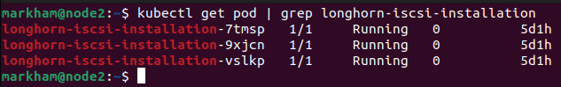
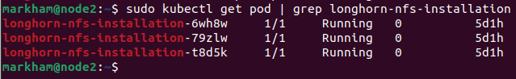
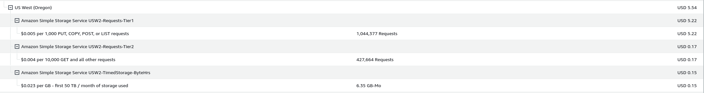
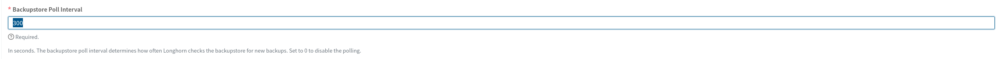

### Installing longhorn for shared storage 

* The big advantage here is that longhorn more or less aggregates about 2/3rds of the storage available to each pod into a shared pool of storage that all the pods can use. A must have if you're going to truly run a high availability setup. 

#### Installation

* Note: these instructions presume that you're going to be installing longhorn using Rancher. You can do it from the command line, but Rancher makes things a lot easier. There are a couple of things I install from the command line, but I more often than not use Rancher as it just makes life a lot easier, especially when it comes to editing the values.yaml files. 

* You'll have two things you'll need to do in order to make sure that longhorn installs and works properly:

    * Installing open-iscsi 
    * Installing the NFSv4 client to enable backups outside of your cluster. 

IF you skip these steps (open-iscsi in particular) the install will either fail or partially succeed and and not work. You can read more about the installation prerequisites [here](https://longhorn.io/docs/1.5.3/deploy/install/#installation-requirements). Luckily, the longhorn web site provides great instructions and makes things fairly easy, IF you use the right option(s) to install the dependencies. 

First: use the following to install open-iscsi - the rancher web site provides several other options to do it, but this way always worked for me, with the others giving rather mixed results: 

    ```
    kubectl apply -f https://raw.githubusercontent.com/longhorn/longhorn/v1.5.3/deploy/prerequisite/longhorn-iscsi-installation.yaml
    ```

Once that's done run the following to make sure everything worked properly: 

```
kubectl get pod | grep longhorn-iscsi-installation
```

You should see something that looks like this: 




Next, use the following to install the NFSv4 client, again, the rancher web site will give you several other options, but this option worked the best for me: 

```
kubectl apply -f https://raw.githubusercontent.com/longhorn/longhorn/v1.5.3/deploy/prerequisite/longhorn-nfs-installation.yaml
```

Once that's done, run the following command to verify that the installation was successful: 

```
kubectl get pod | grep longhorn-nfs-installation
```
You should see something that looks like this: 

 


Next, use these instructions](https://longhorn.io/docs/1.5.3/deploy/install/install-with-rancher/) to do the rest. 

Finally, you're going to have a situation with you longhorn and presumably local-path both set as "default storage classes". You'll need to change this before you try and deploy any applications, otherwise you'll get storage attach errors. Run the following command to ensure that only longhorn is set as your default storage class: 

```
kubectl patch storageclass name-of-storage-class -p '{"metadata": {"annotations":{"storageclass.kubernetes.io/is-default-class":"false"}}}'
```

You can read more about managing storage classes [here](https://kubernetes.io/docs/tasks/administer-cluster/change-default-storage-class/).

#### Setting up S3 backups 

* Short-version: configuring Longhorn to backup to S3 is fairly simple IF you're familiar with AWS, it's basically S3 URI + IAM Role + Keys:
    * Create the IAM role, add it to a group with a policy to access your specific buckets or S3 
    * Create KMS keys
    * Create your bucket, set it up to use the KMS keys you created 
    * Create base64 strings for the key and secret
    * Create a yaml file and use the above to create a secret 
    * Go to general in Longhorn, scroll down and add the path to your bucket and the secret name you created above
    * Go to each volume in longhorn and setup a back up 
* The long-version: just follow this [blog post from Dan Foulkes](https://blog.foulkes.cloud/devops/picluster/longhorn/aws/s3/2022/12/29/pi-cluster-longhorn-aws-s3-backup.html) 

Once you have S3 configured you'll need to change a small setting that's only for disaster recovery volumes, it's a small but critical thing because if you leave the setting as is Longhorn will ping S3 **constantly** and you could easily find yourself racking up more charges for S3 actions than you do for storage. Case in point, for the month of January I was charged $0.15 for storage and $5.39 for requests. 

 

I discovered this by accident because I honestly don't pay that much attention to my AWS bill, but decided to go over it because I need to deploy an object store and was evaluting using AWS S3 or just buying another node to deploy MinIO on. 

You can read more about this issue in a GitHub issue [here](https://github.com/longhorn/longhorn/issues/1547)

To solve it just go to settings and change the Backupstore Poll Interval to 0 and the incessant S3 pings should stop. 

 

Change that 300 to 0 and you should save some money. 


### Additional Tips & Tricks
* Periodically go to the Longhorn UI and validate that you've set up backups for all your volumes. It's easy to forget to do this after you deploy new workloads, create new volume claims, etc. 

* Setup alerts and periodically check how much storage is being used by each service 

* Some services (like Zigbee2MQTT) are constantly receiving or transmitting data and logging practically everything, check how your services log data to make sure you're not about to run out of space in your volume claim. Running out of space can cause your container/service to crash, and you'll need to manually increase the storage size in Longhorn before the deployment can spin up again. I.e., being proactive about storage use can save you a lot o headaches. 