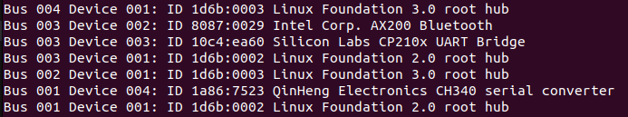
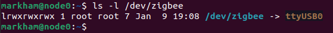

## Configuring your Zigbee USB dongle 

There are a couple of thing you need to do in order to prepare your node so that it and Zigbee2MQTT can communicate with the device properly. 

#### Setup the serial connection 

*Note: these instructions presume the node you've plugged the dongle into is running Linux. Also, you'll have to reboot at least once so draining the node first is a good idea.*

The first thing you need to is to verify that your node can connect to serial devices over USB, unplug any other USB devices from the node and then plug the Zigbee dongle into it and run the following command:

```
ls /dev/ttyUSB0  
```

If that doesn't work try:

~~~
ls /dev/ttyACM0
~~~

If you get "no such file or directory" for both, it likely means another application is blocking your serial connection and chances are it's the brltty library (for the vision impaired), remove it by running

```
sudo apt remove brltty
```

Unplug the dongle and plug it in again, and you should be fine. Re-run the commands from before to verify that the device is connected, and make note of whether it's a USB* or ACM* device. If you're still having issues you may need to run the below to add yourself to the dial-out group, followed by logging out and logging back in. 

```
sudo usermod -a -G dialout your_username_here
```

#### Create Device Address Mapping

Next, we need to create a mapping for your Zigbee device, you don't "technically" need to, but be aware that your device will be given a device along the lines of USB0, USB1, etc., or ACM0, ACM1..., depending on if it's the first, 2nd, etc., device plugged into the node, which can get problematic if you restart with multiple devices plugged in, need to unplug the dongle and plug it back in, etc. 

First, run the following command:

```
lsusb
```


My Zigbee dongle is the Silicon Labs device, the 10c4:ea60 are codes that identify the device. Now run the following to create the mapping 
~~~
sudo nano /etc/udev/rules.d/99-usb-serial.rules
~~~

In that file you'll want to add the following line and then save it, you can put anything youd'd like in place of zigbee.

SUBSYSTEM=="tty", ATTRS{idVendor}=="10c4", ATTRS{idProduct}=="ea60", SYMLINK+="zigbee"

You'll need to reboot the device after this, so drain the node first if you haven't do already. Next, test that the added mapping worked by running the following:

```
ls -l /dev/zigbee
```


#### Some additional tips
* If your zigbee2mqtt instance connects to your MQTT broker, starts up and then suddenly stops, there is a good chance you forgot the "mqtt://" part of your broker address, it's an easy thing to overlook because a lot of other apps don't require that. 
* Using a short USB extension cord can help quite a bit with reception, WiFi signals can interfere with the Zigbee ones. 
* Also, small battery powered devices will more often than not will have signal strength issues, especially if they're on a different floor than your hub. Putting Zigbee smart plugs or other Zigbee devices powered by AC/Mains can help a lot, as those devices will act as signal repeaters/routers and boost the signal strength of the battery powered devices. 
* If it gets frustrating, just remember that once you get this working right, you'll have a repeatable deployment that's easy to move around to various hardware. I.e. once you have a working configuration, it should be very re-usable/repeatable. Once I got this deployed I tested moving the deployment around to different nodes and had no problems, save a few that were specific to the node itself and not to Zigbee2MQTT. 
