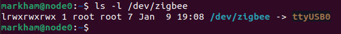

## Instructions for deploying Zigbee2MQTT on Kubernetes 

Deploying Zigbee2MQTT on Kubernetes can be bit tricky due to the dependency on the external device, and a couple of extra steps you need to take to override the container's default settings. However, if you follow the instructions below you shouldn't run into any issues. Just keep in mind that if the service continually fails to start up, it's likely a MQTT issue or an issue with the device address. Let's take care of the device setup first: 

### Configuring your Zigbee dongle 

There are a couple of thing you need to do in order to prepare your node so that it and Zigbee2MQTT can communicate with the device properly. 

#### Setup the serial connection 

*Note: these instructions presume the node you've plugged the dongle into is running Linux. Also, you'll have to reboot at least once so draining the node first is a good idea.*

The first thing you need to is to verify that your node can connect to serial devices over USB, unplug any other USB devices from the node and then plug the Zigbee dongle into it and run the following command:

```
ls /dev/ttyUSB0  
```

If that doesn't work try:

~~~
ls /dev/ttyACM0
~~~

If you get "no such file or directory" for both, it likely means another application is blocking your serial connection and chances are it's the brltty library (for the vision impaired), remove it by running

```
sudo apt remove brltty
```

Unplug the dongle and plug it in again, and you should be fine. Re-run the commands from before to verify that the device is connected, and make note of whether it's a USB* or ACM* device. If you're still having issues you may need to run the below to add yourself to the dial-out group, followed by logging out and logging back in. 

```
sudo usermod -a -G dialout your_username_here
```

#### Create Device Address Mapping

Next, we need to create a mapping for your Zigbee device, you don't "technically" need to, but be aware that your device will be given a device along the lines of USB0, USB1, etc., or ACM0, ACM1..., depending on if it's the first, 2nd, etc., device plugged into the node, which can get problematic if you restart with multiple devices plugged in, need to unplug the dongle and plug it back in, etc. 

First, run the following command:

```
lsusb
```


My Zigbee dongle is the Silicon Labs device, the 10c4:ea60 are codes that identify the device. Now run the following to create the mapping 
~~~
sudo nano /etc/udev/rules.d/99-usb-serial.rules
~~~

In that file you'll want to add the following line and then save it, you can put anything youd'd like in place of zigbee.

SUBSYSTEM=="tty", ATTRS{idVendor}=="10c4", ATTRS{idProduct}=="ea60", SYMLINK+="zigbee"

You'll need to reboot the device after this, so drain the node first if you haven't do already. Next, test that the added mapping worked by running the following:

```
ls -l /dev/zigbee
```



### General Deployment

The values.yaml file in this folder is largely influenced by what I found [here](https://github.com/Koenkk/zigbee2mqtt/discussions/10899), but I had to make a couple of changes to get everything to work properly:  

I was having issues with values defined in the values.yaml or config map being ignored in favor of the configuration.yaml file baked into the image. E.g., putting the path to my Zigbee dongle in the values.yaml file was always ignored file in favor of the path given in the container's config: /dev/ACM0, which is fine if your device is at ACM0, but if it isn't. 

To get around this I followed the instructions on the Zigbee2mqtt web site to override those values by adding environmental variables to the values.yaml file. The best approach is to add a config map to the namespace you're deploying Zigbee2MQTT in, and then reference those values in the values.yaml file. See below for the format to override the values in configuration.yaml file via environmental variables, chances are, if this deployment is failing it's a device or config data issue.

    ~~~
    config:
        serial:
            port:
    ~~~
    becomes:
    ~~~
    ZIGBEE2MQTT_CONFIG_SERIAL_PORT
        value: <path/to/your/USB/device>
    ~~~
* I also added environmental variables for connecting to my MQTT broker and for Zigbee2MQTT's base topic. 
    * Zigbee2MQTT will send data to base topic + device name. So if your base topic is /iot and the name of a device is "garage_temp" it will send that device's data to the /iot/garage_temp MQTT topic. Keep in mind that you can't change the base topic within the app itself even though it looks editable in settings, it will always revert back to what's in the config file. So, just define it via environmental variables as part of the deployment. 
* I added a node name for the node that has the USB dongle attached. I.e., you need to explicitly   define the node, so the pod for this app doesn't get deployed on a node that the dongle isn't plugged into. 
    * You can get around this limitation by using something like ser2net to allow you to effectively stream your USB device over your network/make it available over tcp. E.g., you could plug your Zigbee dongle into a Raspberry Pi 3B or Zero, use the TCP address as the serial port path and now your Zigbee2MQTT deployment isn't tied to a specifc node. I've never tried it, but the instructions for it are [here](https://www.zigbee2mqtt.io/advanced/remote-adapter/connect_to_a_remote_adapter.html)
    * Similarly there are USB network devices that perform the same function as above only with simpler configuration steps, you plug the USB device into the network device and now other devices in your network can receive data from it. If you search usb over tcp/ip on Amazon or Newegg, you can find them for for around $50-$70.00. For the record I've never tried it, but it's on my list. 
* I added resource limits so linting doesn't scream at you + just a good practice. 

Once you have everything configured for your environment, just apply the manifest via kubectl and it will deploy Zigbee2MQTT, configure the service and the volume claims. Once that's done, configure an address via your firewall (e.g. zigbee.local.example.com) and then apply the ingress file. 

#### Some additional tips
* If your zigbee2mqtt instance connects to your MQTT broker, starts up and then suddenly stops, there is a good chance you forgot the "mqtt://" part of your broker address, it's an easy thing to overlook because a lot of other apps don't require that. 
* Using a short USB extension cord can help quite a bit with reception, WiFi signals can interfere with the Zigbee ones. 
* Also, small battery powered devices will more often than not will have signal strength issues, especially if they're on a different floor than your hub. Putting Zigbee smart plugs or other Zigbee devices powered by AC/Mains can help a lot, as those devices will act as signal repeaters/routers and boost the signal strength of the battery powered devices. 
* If it gets frustrating, just remember that once you get this working right, you'll have a repeatable deployment that's easy to move around to various hardware. I.e. once you have a working configuration, it should be very re-usable/repeatable. Once I got this deployed I tested moving the deployment around to different nodes and had no problems, save a few that were specific to the node itself and not to Zigbee2MQTT. 

### Critical step once you deploy the application

The default for Zigbee2MQTT is to log EVERYTHING, meaning every single time it receives data from any of your devices it will update the log file with the values from that device. Even if you only have a dozen or so devices it won't take long before you use up your container's allocated space for logs (the mount for /data), and then the container will crash. To avoid this: go to settings --> advanced --> Log level and set it to "warn" at minimum, so the service is only logging things you need to troubleshoot or address problems. 

If your container crashes due to this issue you'll get an "out of space" error, and the path to fixing it is just manually increasing the size of persistent volume claim via Longhorn (or whatever you use for storage), once the container crashes it will be too late to fix it in the values.yaml file, because the the container won't be able to spin up and increase the size of the volume claim. 

FTR, I looked for a setting or config for deleting old logs but couldn't find anything, my plan is to keep looking and if I don't find anything either build a fix myself and/or raise it as an issue. 
