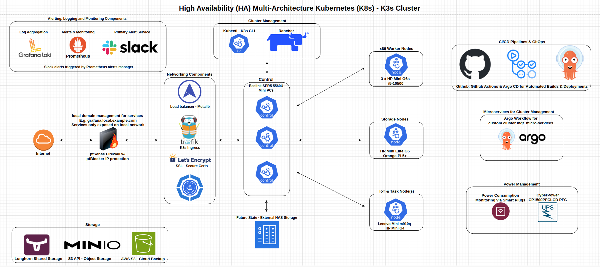

## Hardware Architecture & Software Stack 2024

### My Cluster: High Availability, multi-architecture - amd64/x86 and arm64
* **Hardware:** 
    * **Server/control plane nodes:** three "Intel NUC like" **Beelink SER5s running Ryzen 5 5560u processors (6c/12t), 64 GB of RAM and 2 TB of storage**. I got them for around $225.00/each on sale from Amazon (down from around $300). With Geekbench 6 scores around 7k (in my testing), you can think of them as getting about 80% of the performance of an 11th gen desktop i5 while using a fraction of the power. The fans also run quieter than the ones in my 12th Gen Intel NUC, albeit at the cost of higher temperatures.

    **Update 8/20/2024:** After noticing that the Beelinks were running in the 60s-70s and wanting to avoid some of the performance issues that can come with using your control nodes to run longhorn and general compute workloads, I decided to split up my cluster into dedicated nodes for: control, general workloads, and storage. The result has been greater stability, the control plane running in the 40-50 degrees celsius range instead of 60s-70s, and an end to some intermittent issues with Longhorn volumes not attaching, resizing, etc.
    
    I've also decided to remove the Raspberry Pis and replace them with dedicated devices for gathering climate data, and/or by connecting the sensors to micro-controllers; the reasons for this are as follows:
    * Dedicated sensor devices and microcontroller based sensors rarely need much in the way of attention, don't have USB ports that go to sleep every few months, etc.  
    * The software for ingesting the sensor data can now run on any node on the cluster, thus making things "more Kubernetes"; this combined with the above makes the climate monitoring setup significantly more robust.  
    * I can move the under-utilized Pis to other projects

    * **Agent Nodes:** 
        * **x86 Worker Nodes: 3 x HP Mini G6s running Intel i5-10500:** I've become a big fan of trying to find ways to re-use parts I have sitting around gathering dust, and giving a second life to capable hardware that might otherwise end up as e-waste. I picked one up used on Amazon for about the price of the Beelinks and got a device that runs a replaceable desktop CPU, runs 15-20 degrees cooler, can support two M2 NVME drives AND an SSD and is a little faster than the Beelinks. I'm also in the process of procuring HP Flex IO devices to upgrade the networking to 2.5Gbe 
        
        * **Storage Nodes:** the original plan was to use two HP G5 Minis as the networking can be upgraded to 2.5Gbe, but since I had Orange Pi 5+ that wasn't being used I went with one G5 and one Orange Pi 5+ since the latter has dual 2.5Gbe. Given the G5 can support two M2s and an SSD, two G5s is a better approach, but this works for now. 

        * **IoT/Task Nodes:** I picked up a Lenovo m910Q on eBay for $30.00 that didn't have a CPU, Wi-FI card, RAM or a HDD because it could run the 7th Gen Intel CPU I had in an old gaming machine with a damaged motherboard. Once I got it up and running I added it into the cluster, set the node labeling so it primarily runs IoT and ETL related workloads and it has run flawlessly. I later picked up an HP G4 (similar situation, but it had a CPU) and have it running in a similar capacity.  

    **Future Plans:** 
        * add a NAS that will primarily be used for home storage and back-up so we don't have to use cloud services, but attach it to the K3s cluster as well for back-ups for running MinIO separately from Longhorn storage.
        * Use something like an N100 SBC or maybe even Rockchip 3588 compute modules to run cluster apps: Cert Manager, Traefik, etc.,      
        
    * **Power Management:** 
        * **CyberPower UPS device:** I have a Rasberry Pi 4B (not part of the cluster) running [Network UPS Tools - NUT](https://networkupstools.org/), which allows it to monitor the state of UPS devices connected to it via USB. I then have a container running on the cluster that can query NUT to grab the latest UPS data and then write it to InfluxDB. You can take a look at the code for the monitoring container [here](https://github.com/MarkhamLee/internet-and-iot-data-platform/tree/main/IoT/cyberpowerpc_pfc1500_ups).  
        * **Kasa Smart Plugs:** monitored via the [Python Kasa library](https://github.com/python-kasa/python-kasa), this allows me to track how much power my *"Homelab Devices"* are using.
        * **Zigbee Based Smart Plugs:** these devices serve a dual purpose: as not only do they provide real time power consumption data, but they also serve as Zigbee routers that augment the Zigbee network.
    * **Future state(s):** dedicated storage nodes that will just run Longhorn and MinIO 
    * All of the nodes are running Ubuntu 22.04, the Orange Pi 5+ is running a community built [Ubuntu 24.04 server distro](https://github.com/Joshua-Riek/ubuntu-rockchip) made especially for Rockchip 3588 devices.  