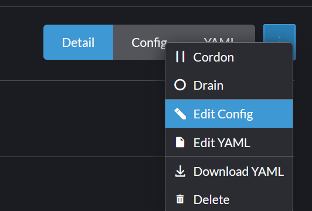
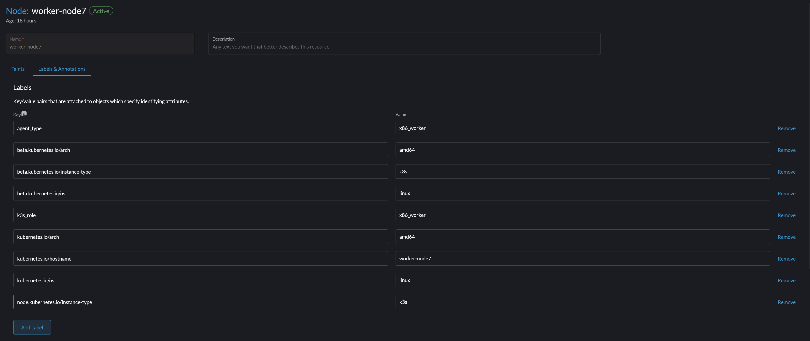

## Adding nodes to a Rancher managed cluster that was initially created with Ansible

Creating a cluster with Ansible and then managing it with Rancher, followed by updatin your K3s version with Rancher is convenient but can cause some problems when you then treat the cluster like a "Rancher cluster" and attempt to add nodes (removing is fine) via the Rancher method:

* The kublet keeps restarting
* Pods are struggling to see available disk space 
* Random apps are not accessible even though they show as running just fine in Rancher 

The cause of this problem is likely that you are using the Rancher method of adding nodes and that is not playing nicely with how things are setup via Ansible. While the seemingly obvious solution is to just go back to using the Ansible playbook to add or remove nodes, reember that you already updated the K3s version with Rancher and if you go back to Ansible you're likely to cause MORE problems. The solution is that while you can drain, cordon and remove nodes with Rancher, you have to effectively manually add the individual nodes via CLI commands that mimic what Ansible does. 

### Get the cluster token and service definition 

Run the following command on a healthy node, grab the output and put it aside for later. There might be something like ">" on the line with the token, be sure to remove that. 

~~~
systemctl cat k3s-node
~~~

The output will look something like this, your token will be in there so don't worry about that. You might need to change the name of the name of the ethernet port the server will use for K3s (it's enp2s0) for my server in the example below. 

~~~
# /etc/systemd/system/k3s-node.service
[Unit]
Description=Lightweight Kubernetes
Documentation=https://k3s.io
After=network-online.target

[Service]
Type=notify
ExecStartPre=-/sbin/modprobe br_netfilter
ExecStartPre=-/sbin/modprobe overlay
ExecStart=/usr/local/bin/k3s agent --server <your k3s cluster IP here>:6443 --token <alphanumeric_token_string_here>::server:<alphanumeric_string> --flannel-iface=enp2s0 
KillMode=process
Delegate=yes
# Having non-zero Limit*s causes performance problems due to accounting overhead
# in the kernel. We recommend using cgroups to do container-local accounting.
LimitNOFILE=1048576
LimitNPROC=infinity
LimitCORE=infinity
TasksMax=infinity
TimeoutStartSec=0
Restart=always
RestartSec=5s

[Install]
WantedBy=multi-user.target

~~~

### Prepare your server for K3s

Next, prepare the server you want to add to you cluster, ideally, this would be a machine you've done a fresh Ubuntu install on, just to avoid any "weirdness" or conflicts with what you've already installed on the machine. After you've installed Ubuntu and updated the OS, do the following:

1. Turn off swap

~~~~
sudo swapoff -a
sudo sed -i.bak '/ swap / s/^\(.*\)$/#\1/' /etc/fstab
~~~~

While not an explicit requirement, I always reboot after turning off swap 

2. Install some basic packages and utilities so you can manage the server and install the k3s binaries  

~~~
sudo apt -y install curl htop lm-sensors openssh-server
~~~

If you're using Ubuntu 24.04 go into the UI and make sure that ssh access is activated 

3. Install dependencies for K3s in general and Longhorn for storage 

~~~

sudo apt -y install ca-certificates open-iscsi nfs-common
~~~

Again, not explicitly required, but I always reboot after this step 

### Install K3s 

This will pull down and install the most recent K3s binaries, adjust this URL to match the version you're currently using IF your cluster hasn't been updated to the latest version of K3s. 

~~~
curl -sfL https://get.k3s.io -o /tmp/k3s_install.sh
chmod +x /tmp/k3s_install.sh
~~~

Install K3s on the server 

~~~
K3S_URL="https://192.168.47.222:6443" \
K3S_TOKEN="<use the full token string from the step above, JUST the token string, not the entire output>" \
INSTALL_K3S_SKIP_ENABLE=true \
INSTALL_K3S_SKIP_START=true \
/tmp/k3s_install.sh agent
~~~

### Join the node to the cluster 

The file you'll run will be basically be: adding the node's interface name to the output of the "systemctl cat k3s-node" command and sandwiching betweeen "sudo tee /etc/systemd/system/k3s-node.service >/dev/null <<'EOF'" and "EOF" with the final output looking something like this 

You could run the below as a file or just cut and paste into the CLI. 

~~~

sudo tee /etc/systemd/system/k3s-node.service >/dev/null <<'EOF'

# /etc/systemd/system/k3s-node.service
[Unit]
Description=Lightweight Kubernetes
Documentation=https://k3s.io
After=network-online.target

[Service]
Type=notify
ExecStartPre=-/sbin/modprobe br_netfilter
ExecStartPre=-/sbin/modprobe overlay
ExecStart=/usr/local/bin/k3s agent --server <your k3s cluster IP here>:6443 --token <alphanumeric_token_string_here>::server:<alphanumeric_string> --flannel-iface=enp2s0 
KillMode=process
Delegate=yes
# Having non-zero Limit*s causes performance problems due to accounting overhead
# in the kernel. We recommend using cgroups to do container-local accounting.
LimitNOFILE=1048576
LimitNPROC=infinity
LimitCORE=infinity
TasksMax=infinity
TimeoutStartSec=0
Restart=always
RestartSec=5s

[Install]
WantedBy=multi-user.target

EOF

~~~

From here your node should join to K3s without incident and should appear in Rancher. 

### Final Steps - Optional depending on you how you ruh K3s

In the Rancher UI

* Nodes --> click the new node and then use the menu in the top right hand corner to select "Edit Config" 

From here add any labels are taints you want to add for this node 

