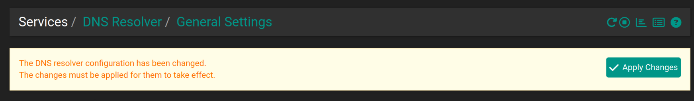
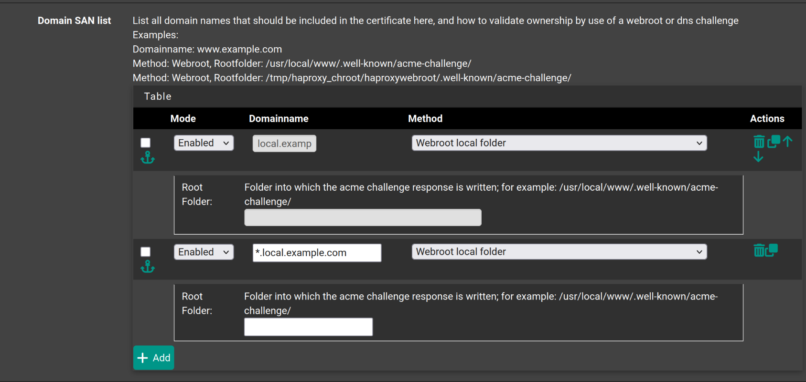
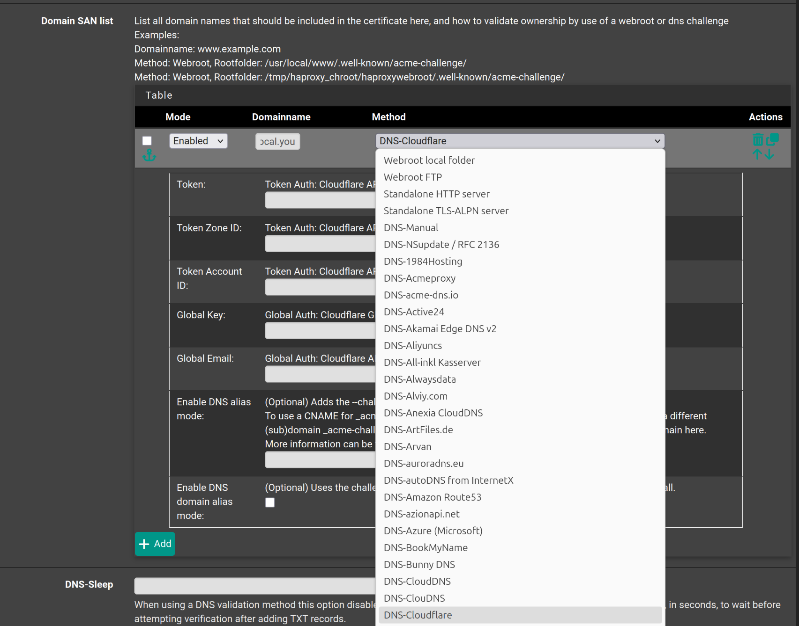
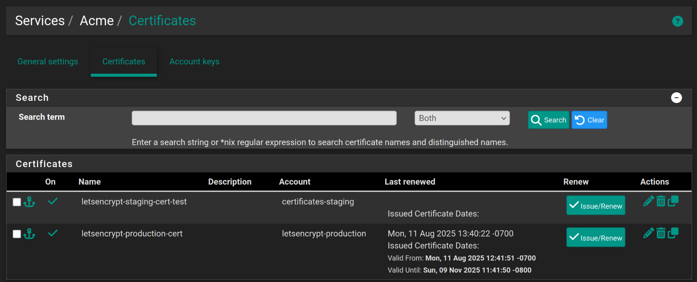
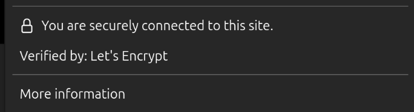

Setting up Secure Certificates for pfSense 

While not technically a K3s topic and not really needed to enable K3s networking, it doesn't make sense (to me) to route your k3s service domains through a firewall that isn't using a secure cert to lock down access to its UI. The high level goal will be to setup a secure certificate on your pfSense instance so that you can type: "pfsense.local.yourhomelabdomain.com" (or whatever you want the domain to be) to access the pfSense UI. I.e., it doesn't make much sense to lock down individual K3s services with secure certificates and then leave the UI for your **FIREWALL** unsecured. 

### Preparation

These steps presume that you've already setup/have a domain name and have a Cloudflare account 

#### Get Cloudflare API data 

1) Login to Cloudflare and click the profile icon in the top right hand corner and click "profile"
2) In the left hand menu click "API Tokens" 
3) Click "Create Token":
    * Under permissions you want "Zone DNS Edit"
    * Under "Zone Resources" you want "Include All Zones"
4) Click continue to summary, create the token and set the token aside for later 
5) Go back to the API token page, click "view" under Global API key and make note of the API key. 

#### pfSense Preparations 

We're going to create a few things that we'll use with the certificate we're going to create 

1) Create custom domain name, if you use an external tool like Pi-Hole, Ad Guard or Technitium to manage your domain names, you should use that tool to create the domain instead. 
    1) We'll create private (or custom) domain name we're going to use to access pfSense. Go to services --> DNS resolver and then scroll down to the bottom of the page to the "Host Overrides" section and click "Add" 
        * Host = what you'd input before local.example.com, e.g., "pfsense" or "myfirewall"
        * Domain = your domain name with local addeed or local.yourdomain.com 
        * IP address is the IP address you use to access pfSense 

    2) Click save and you'll see a message at the top of the page that looks like this
    
2) Less a step and more checking current status, go to System --> Certificates and then click the certificates tab, presuming you haven't created any certificates prior to this you should just see a certificate with "GUI default" in the name. This is the self-signed certificate created by your pfSense install. This "technically enables HTTPS but since it's self-signed and hasn't been verified by a 3rd party, it's easy to spoof it for a "man in the middle attack" where a bad actor inserts themselves between you and the browser and captures your login information. When we create certificates we'll see more data listed here.

### Configuration Steps 

1) To start, we need to install Acme the package used to manage the secure certificates. Go to System --> Package Manager --> Available Packages and install Acme. Once the package is installed, Acme options should show up under services in the pfSense UI. 
2) In this step we'll create the account key that wil be registered to our pfSense instance and allow us to create certificates. Go to Services --> Acme Certificates and then click on the "Account Keys" tab to setup Lets encrypt (via Acme) on your pfSense instance. Click add and fill out the form. You'll need to do this twice, once for the staging environment and then again for the production one. 
    1) Under "Acme Server" you'll select the staging or production server
    2) Click "Create new Account Key" to generate an account key, you should see a checkmark when this has completed successfully  
    3) Click "Register Acme Account key" to register the account key, like the above, you'll see a checkmark when things are completed.
    4) Click save 
3) In this step we're going to generate a secure certificate via the staging server to make sure we have things setup properly, we do this because you can only hit the production API a fixed number of times a day before getting locked out for a week, so by using staging we have room for error. Click the "Certificates" tab and then click "Add". 
4) Fill out the form, it's fairly straightforward, however:
    * Under Acme Account, you select the staging environment account you created earlier. 
    * Under domain make sure you have at least two entries like the below, you're adding an entry for the main domain e.g., local.example.com, and another wildcard for the specific services: *.local.example.com - the 2nd entry allows you create something like pfsense.local.example.com without having to register a certificate for that specific domain/or each specific domain you're setting up. 
    
    * This next bit is critically important, you must use the Method drop down to select "DNS-Cloudflare" as this "method" is what we need to use validate that the domain name we created earlier is real. E.g., "homelab.com".
    * In the space for Token auth enter your Cloudflare API token 
    * In the space for Global key enter the Global API key
    * Enter in your email 

    
Before we click save let's review what we should have here:
    * At least two domains, something like local.example.com and a wildcard card *.local.example.com
    * We should have selected DNS-Cloudflare as the method and entered in our Cloudflare information 

Click save. If you get an error message like: "Wildcard 'Domainname' validation requires a DNS-based method", double check that you selected Cloudflare and put in the right information.

5) Now that we have a certificate setup, we're going to issue a certificate. Services --> Acme Certificates and then the certificates tab and click "Issue/Renew", you should see a wall of text in a green background at the top of the page. 
6) Now let's use our staging certificate. Go to System --> Advanced and then then webConfigurator section:
    1) Make sure "HTTPS (SSL/TLS) is selected
    2) Under SSL/TLS select the certificate you just created 
    3) Go down to "Alternate Hostname" and type out the full domain you created for your pfSense instance, e.g., pfsense.local.example.com 
    4) Click save 
7) Go to System --> Certificates and then click the certificates tab, you should see the staging certificate you created. 
8) Try typing the updated host name you created, e.g., pfsense.local.example.com into a browser, it should take you to the UI but you should get the browser warning as it's not a proper certificate. 

### Troubleshooting 

* If the domain doesn't work, double check your configuration, IP address, etc. 
* If creating the key doesn't work, you probably just filled out the form wrong, the error messages are fairly informative and will tell you what you did wrong. 
* If the creation of staging certificate doesn't work, double check filling out the form and similar to the above, double check the form. 

### Issuing Production Certificates 

Presuming things have gone well, we can now issue a production certificate, are identical to the above, only:

1) This time click "Issue/Renew" for production certificates
2) Follow the same steps as before for filling out the form. Once the certificate is created, Services --> Acme Certificates and the certificates tab should look like this, showing the production and the staging certificates. 

3) Go to System --> Certificates and click the "Certificates" tab, to verify that your production certificate is there 
4) Go to System --> Advanced and change the SSL/TLS certificate to the production you created via the drop down and then click save. 
5) At this point it's a good idea to reboot and then try full domain name to access the UI, you should be able to access the UI without any browser warnings and by clicking the lock (or similar) icon in your browser you should see something like:

At this point you should be good to go, if not refer to the troubleshooting steps or use the error messages to look up information on your specific error, as I only provided error info on the errors I've made in the past and you might make different mistakes. 

### Final Steps

1) 
