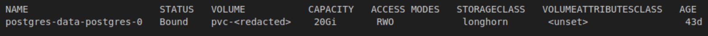

## Updating the size of a PVC

Note: this write-up presumes that you've deployed Postgres via K8s manifests, however, if you run into similar errors via a Postgres instance deployed via Helm, you should be able to use these instructions to synthesize a solution for your deployment type. Also, these instructions will only work if your K3s storage class allows volume expansion. I use Longhorn so I can confirm these instructions work for Longhorn, but I cannot confirm if they will work for other types of storage. You can verify if your storage class allows expansion via the following command 


```
kubectl get storageclass <storage class name> -o yaml | grep allowVolumeExpansion

```


When trying to increase the size of a volume claim (e.g., in response to an alert saying that Postgres is running out of space), you  may get an error like the following in ArgoCD after you update the size of the claim in the statefulset:

```
Failed sync attempt to 2bab79e3390d51fd3d7effd26d6b1d5c1b224056: one or more objects failed to apply, reason: error when patching "/dev/shm/2017664381": StatefulSet.apps "postgres" is invalid: spec: Forbidden: updates to statefulset spec for fields other than 'replicas', 'ordinals', 'template', 'updateStrategy', 'persistentVolumeClaimRetentionPolicy' and 'minReadySeconds' are forbidden

```

Fixing this is somewhat convoluted but the steps are simple:

1) Revert the change in the statefulset manifest to match its original value. E.g., if it was at 10Gi and you ran into the error after changing it to 20Gi, change it back to 10Gi. 
2) Make note of the name of the PVC you're trying to update
3) Use kubectl to run a patching command from the command line, for example:

```
kubectl -n postgres  patch pvc postgres-data-postgres-0 -p '{"spec":{"resources":{"requests":{"storage":"20Gi"}}}}

```

4) Verify that the patch was successful via this command 

```
kubectl -n postgres get pvc postgres-data-postgres-0

```

The command above should show you something like the following



5) Turn off auto sync in ArgoCD so that the stateful set change you're about to make in the next step isn't "healed" or fixed by ArgoCD. 

6) Delete the stateful set via Kubectl with the following command, the "--cascade=orphan" bit is critical because it ensures that your pods and data remain intact. We just want to remove the stateful set so we can push a new config via Git and not run into the errors due to trying to sync an immutable object. 

```
kubectl delete statefulset postgres -n postgres --cascade=orphan

```

7) UUpdate the storage size in volumeClaimTemplates section of the statefulset manifests, to the desired new size, it should match the size you patched/updated it to in step 3, otherwise, you'll a fresh set of errors.

8) Resync via ArgoCD and turn back on auto sync. Verify that both the PVC and the stateful set show the updated size for the volume claim and that things are all "green" in ArgoCD. 