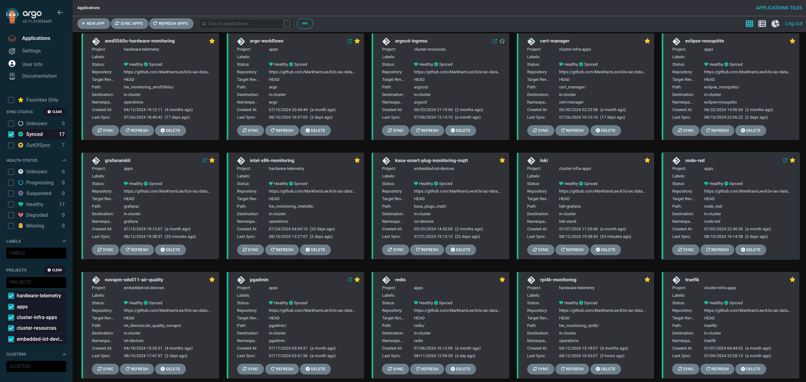

### Deploying Argo CD

I use a fairly basic approach to deploying Argo CD, where I just deploy/make updates from the command line:

```
kubectl apply -n argocd -f https://raw.githubusercontent.com/argoproj/argo-cd/v2.10.0/manifests/ha/install.yaml
```

After the initial deployment you can use Argo CD to manage your Argo CD (Dev Ops Inception), however, I don't plan on trying that until I stand up a beta cluster I can test it on.  

#### The ingress was a bit tricky:
* Create (if it doesn't already exist) a config map file named: "argocd-cmd-params-cm" and then set the parameter: server.insecure: true - this will allow Traefik to handle the secure connection bit. 

Next, use an ingress file like the one in this folder and you should be good to go. Note, I put the ingress file in a GitHub folder and pointed ArgoCD to it, so it will monitor/manage the ingress file. Seemed a good idea given how tricky it can be when using Traefik for your load balancer. 



Not sure why, but I really enjoy these app tiles. 

#### Configuring GitHub repos to store application deployment files 

* You'll need to setup a GitHub repo to store your application config files/manifests, IAC, etc. Persuming you keep the IAC repo private, you'll need to create a personal access token (PAT) so that ArgoCD can access the repo. 
* You'll add the repo via the settings --> repositories menu, within that menu there will be user name and password field, just put "admin" for the user name and the PAT for the password. 
* On a periodic basis you'll need to access the PAT. Keep in mind that you'll maintain the tokens via the UI and not via K3s secrets, so you'll need to edit the repo in the ArgoCD UI and update the PAT. 