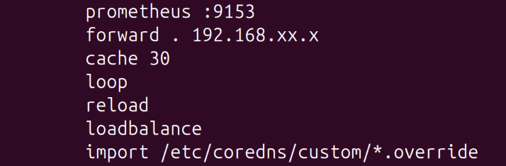

## DNS Troubleshooting


### Key Symptom: Intermittent Connectivity after ISP change, new router, etc. 

Problem: you've switched firewalls, routers, redeployed with a different network appliance, etc., and now some services have internet connectivity and others don't. These connectivity issues will sometimes be constrained to specific nodes, but sometimes you can go to a browser and reach something like Docker Hub on that node, but the node can't reach Docker Hub while running K8s pods.  

Likely root cause: Kubernetes maintains its own DNS data/cache that it uses for DNS resolution, data that won't necessarily change if your DNS ip changes, this is why the individual nodes can reach certain sites just fine, but the pods running on those nodes cannot.  

Solution: update your K3s DNS data and then push that update out across your cluster. 

1) Verify what I've described is the actual problem via running the following from a control node or a machine running Kubectl AND connected to your cluster

```
kubectl run -it --rm busybox --image=busybox --restart=Never -- nslookup github.com
```
This command will fail if the problem is in fact the Kubernetes DNS data 

2) If the above failed run the following commands either from a machine that can run Kubectl or from one of your control nodes. If you run this command on a K3s control node, you may need to include sudo before the kubectl command. 

```
	export EDITOR=nano
	kubectl -n kube-system edit configmap coredns
```

3) Once you're in nano, look for a line that looks something like this: 



Replace what's after the period with the IP of your DNS if you're using a specific DNS app (Pi-Hole, Technitium) or that of your firewall or router. 

Press "ctrl o" to save and then "ctrl x" to exit. 

4) Run the following command to trigger a slow update of DNS across the nodes in your cluster. 

~~~
kubectl -n kube-system rollout restart deployment/coredns
~~~

Wait about five minutes (for a small cluster the change might be near instantaneous, but wait five minutes anyway) and then re-run the command from step 1, the response should now be an external IP address. From here things should return to normal rather quickly. 


