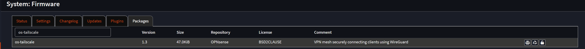

## Configuring Tailscale for OPNsense 

### Installation

You're going to find instructions online telling you to install Tailscale from the command line:
* Don't do it, it won't work, you'll get errors, install from the UI instead
* You will, however, need to do the initial login from the command line 

Your mileage may vary here, but that's what worked for me. 
* Go to System --> Firmware --> Plugins 

* Go to the packages tab and search for Tailscale 
* Install os-tailscale 
* Go to the CLI and run the "Tailscale Up" command, and then go through the usual sign-in process. 

### Configuring Key Features 

#### Configuring as an Exit Node

Setting up your router for this purpose makes perfect sense, after all, it's a router that you've put on your Tailnet, it makes perfect sense that it should be used an exit node. However, my suggestion is: don't. The configurations for using your OPNsense (or pfSense or OpenWRT for that matter) router as an exit node, often causes other things to break whether it's basic router functionality or the ability of the router to do things like route non-tailscale traffic to Tailscale. The typical scenario is that sometimes things work, sometimes they don't, etc. I've had better luck just using a separate device as an exit node, and putting Tailsacle on OPNsense to enable remote access and facilitating communication between the Tailnet and non Tailsacle devices. 

### Routing non Tailscale devices to Tailscale IPs
* If you want your router to route requests from non Tailscale devices to Tailscale IPs:
    * Setup the appropriate ACLs in Tailscale to limit access
    * Create an Alias of only the devices you want to be able to do this, opening up your entire Tailnet to your LAN runs contrary to the point of using Tailscale, no? 
    *  Add the Tailscale interface via the same process indicated above for interfaces 
    * Create a NAT rule:
        * Type: Hybrid Outbound
        * Interface: Tailscale
        * Source: your alias with the select group of servers
        * Source, Destination & NAT ports should be wildcards or "*" UNLESS you have a select group of ports you want to limit things to. 
        * For destination use a select # of Tailscale IPs via an Alias (ideal) or you could put * here, or the subnet for your Tailnet
        * For NAT address use Interface address
        * Select "Static Port" 
    * Everything "should" work with the NAT rule but it's good practice to also create a firewall rule:
        * Just clone an existing "Allow Any" rule and make two changes:
            * Use the Alias of your non Tailscale devices as the source and then make the destination your Tailscale interface name + "net" E.g., "Tailscale net" 

