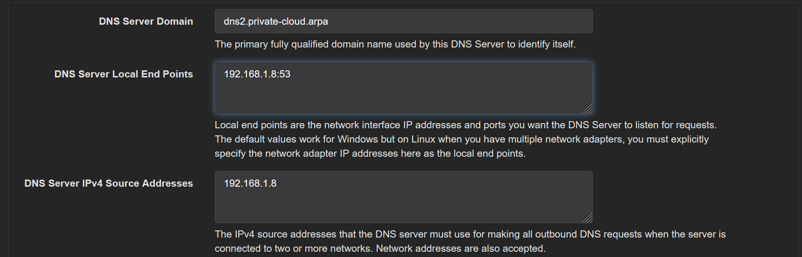
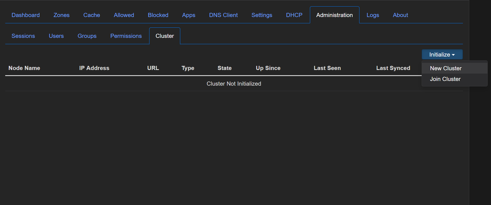
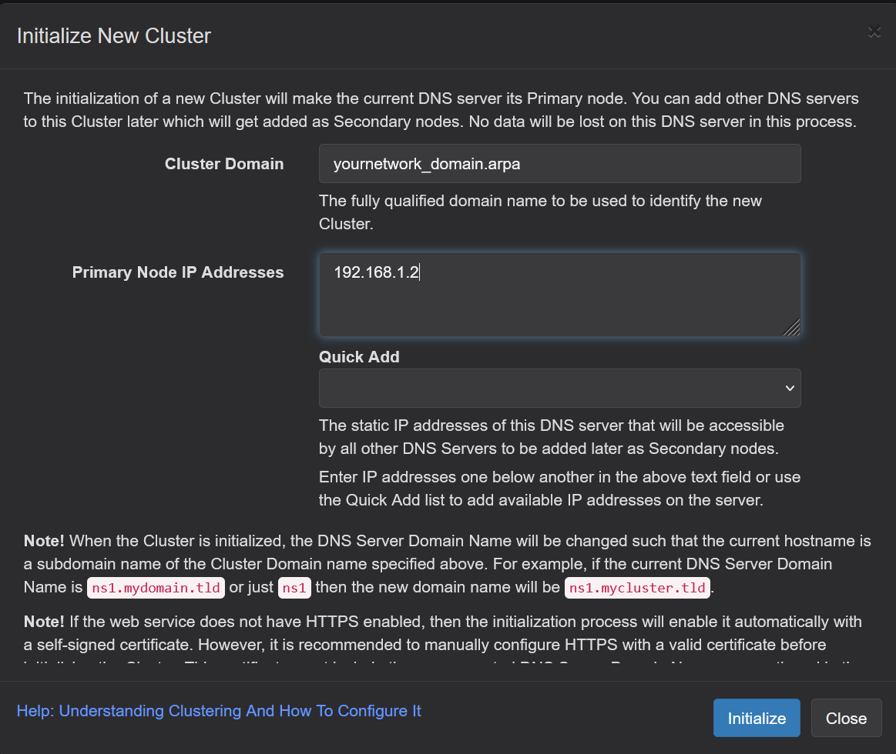
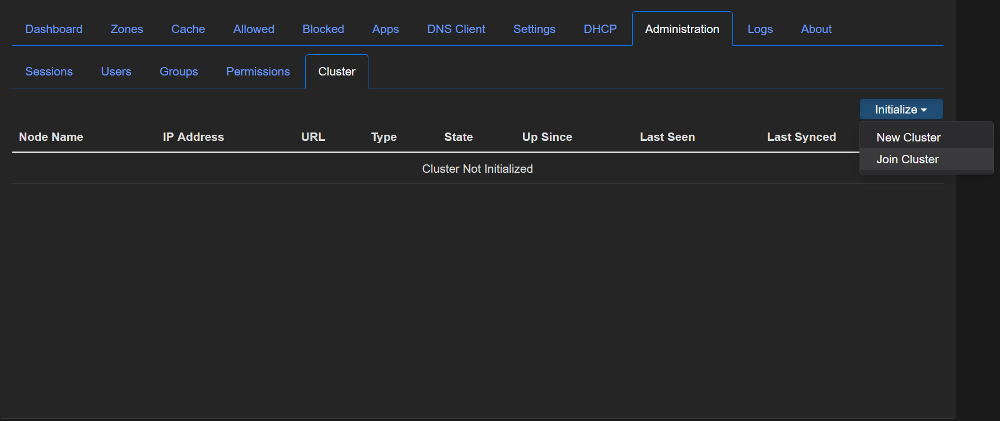
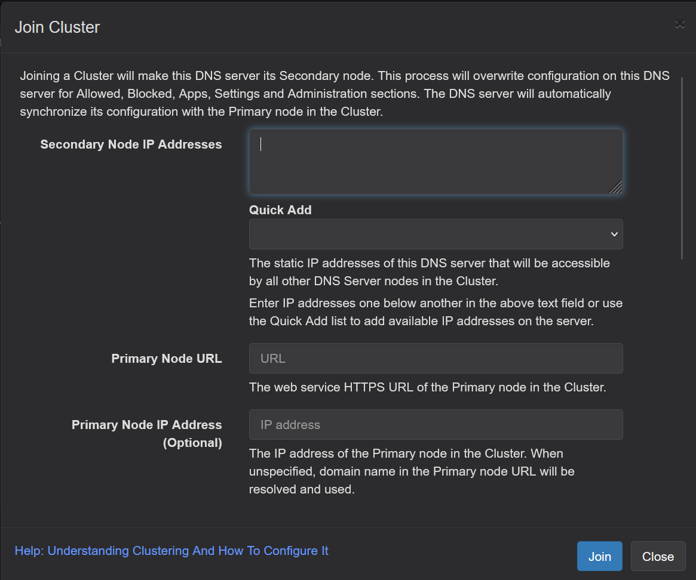
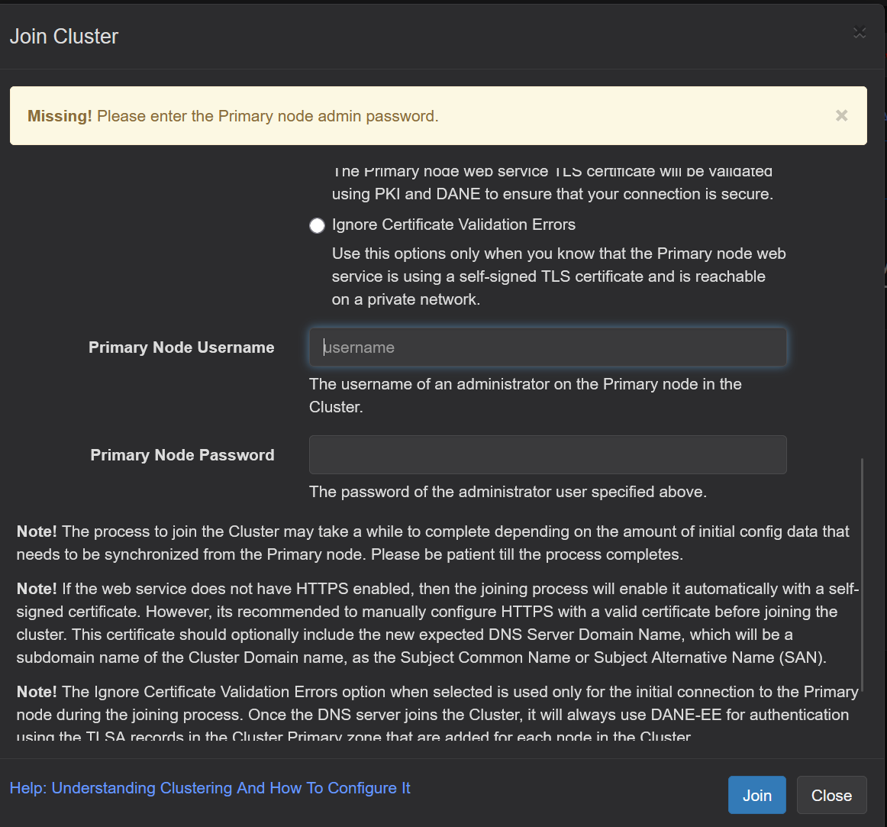

## Technitium Clustering 

Historically, if you wanted to run multiple Technitium DNS servers your options for ensuring all the servers had the same data for DHCP reservations, local entries, etc., would be:

* Manually enter in key settings like DHCP reservations and local DNS entries on each server
* Use the API + custom code to copy the settings between servers. 

Technitium's recently introduced clustering features, allows you to run multiple DNS servers that are linked together, meaning, you can update key settings like DHCP reservations, local DNS entries, etc., on one server and they'll propagate to the rest. Additionally, the dashboard will enable you to view aggregate traffic data across all of your DNS servers or view data for a singular server.  

### Clustering Pre-Requisites 

These instructions presume the following: 

* You already have a primary or existing instance of Technitium up and running. If you don't, you should skip these instructions for now and go to the [instructions](deployment/readme.md) for setting up a single instance, get that setup and once it's stable, then come back to these instructions to setup your cluster. 
* You're running OPNsense, if you're not running OPNsense you'll need to refer your firewall's documentation to see where you would input the IP address for your DNS services. 
* You're using a reverse proxy server and local DNS entries to point to local domain for the Technitium UI, e.g., something in the form of "technitium.local.your-private-cloud.com" 

For ease of administration, it is recommended that once you get the cluster setup, you just do all your admin tasks from the primary node. 

### Setting up secondary nodes for your cluster

The first thing you'll need to do is to setup one or more "secondary" nodes for your cluster. 

1. Deploy a 2nd Technitium instance
2. While nearly all configuration will come from the primary Technitium node, there are a couple of tasks you will need to do manually before you join the secondary node to the cluster: 
    1. Go to Settings --> General and add the domain name for this particular DNS server, e.g., dns2.private-cloud.arpa 
    2. Input the secondary node's IP address in the two boxes, the first is the IP that the server will receive the requests and the second one is the outgoing IP it will provide for upstream requests. Be sure to input the local endpoint in the form of ip_address:53  

If you forget this step before you create the cluster, you can go to general --> settings and then use the clustering drop down to select the secondary node and input its settings. Once the cluster is up and running, you'll be able to do this from any node on the cluster. 

### Setting up the cluster 

1. Login to your primary Technitium instance and go to Administration --> Cluster - Initialize and click "New Cluster". 

2. Enter in the following data to setup the cluster and then click initialize
    * For Cluster domain use the domain you have in OPNsense 
    * Use the IP address of Technitium server, you can use the Quick Add to select the IP (don't use th 172.*) address, it's the internal Docker IP

3. Go the UI for your 2nd Technitium instance and go to Administration --> Cluster --> Initialize --> Join Cluster 

4. On the next page, input the following information to join the cluster:
    * Enter the IP address of the secondary server as the IP address
    * Presuming you have a local LAN URL configured, input the URL of the primary Techntium instance
    * Input the IP address of the primary Technitium instance 

Click Join

5. On the next page, you'll get a "missing" message and will be asked to input the login credentials for the primary Techntium node. 

Once you join a secondary DNS to the cluster, you'll need to use this same password to login to its UI, and its original password will no longer work.  

After you join the secondary node it will take several minutes for data to propagate between the primary node and the secondary one. However, you'll immediately see a drop down on both servers that will allow you to see/manage each one, however, settings, DHCP reservations, DNS entries, etc., will automatically propagate between all the devices in your cluster.

6. Login in to OPNsense and go to Systems --> Setttings --> General and add the IP addresses of the secondary nodes. 

From here, your cluster should be up and running the devices on your network will be able to route DNS requests to both machines. 
