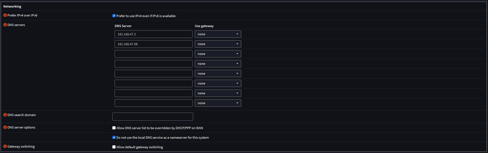
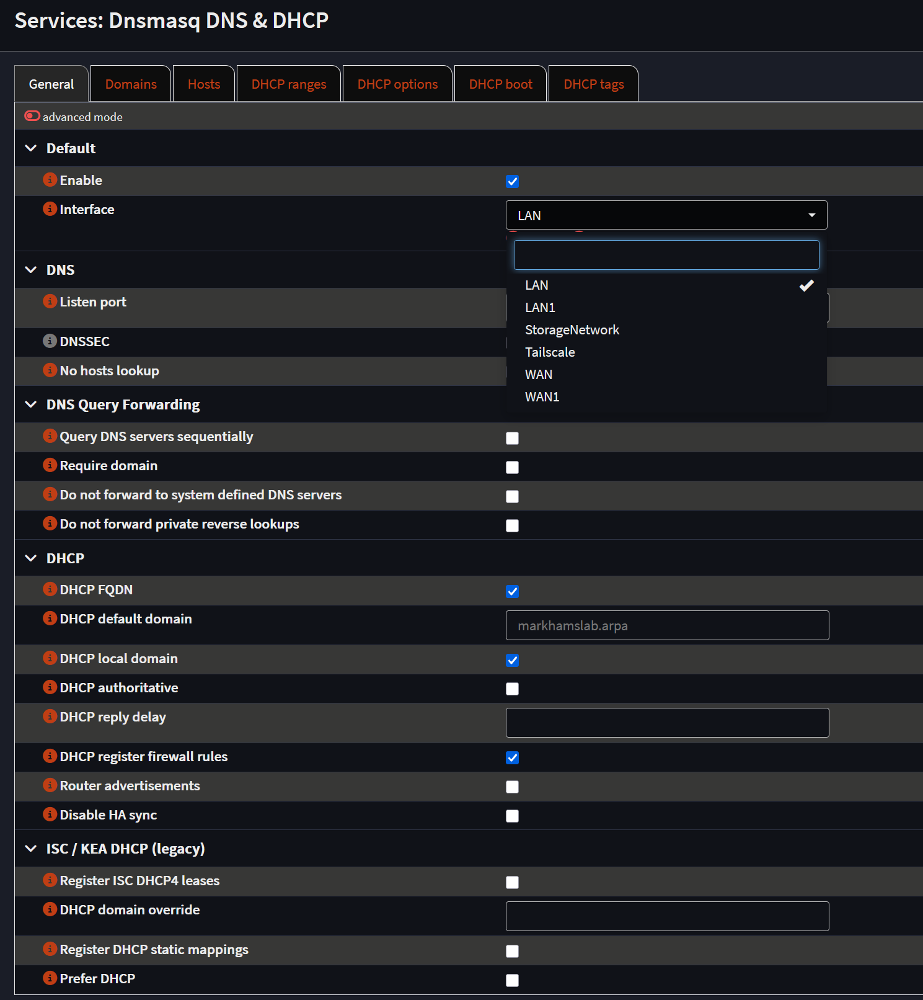
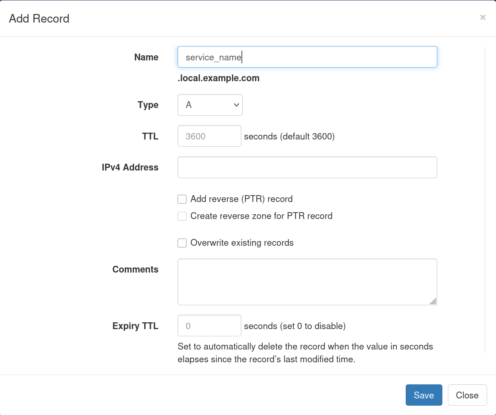
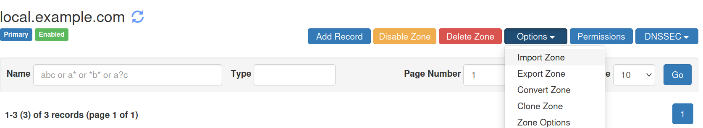
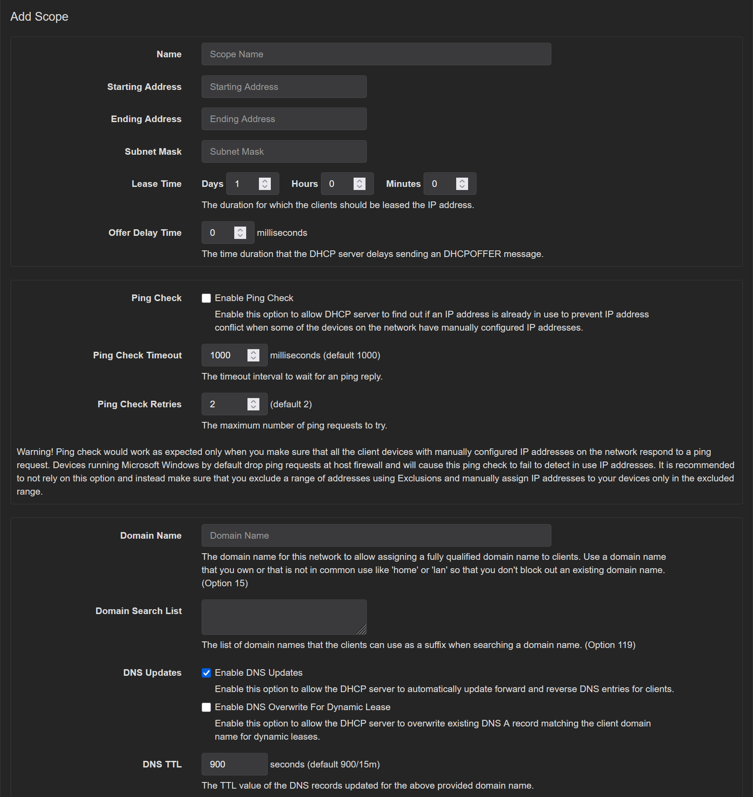
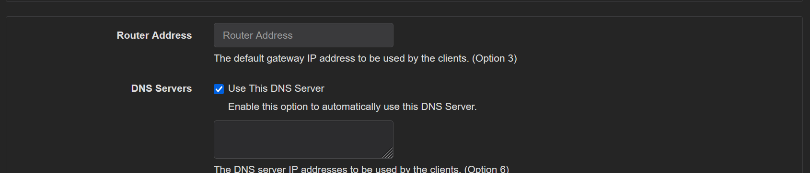
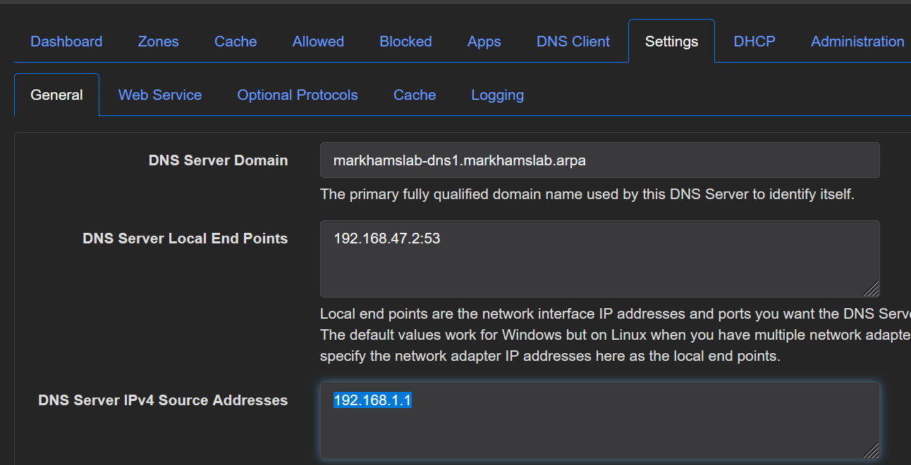
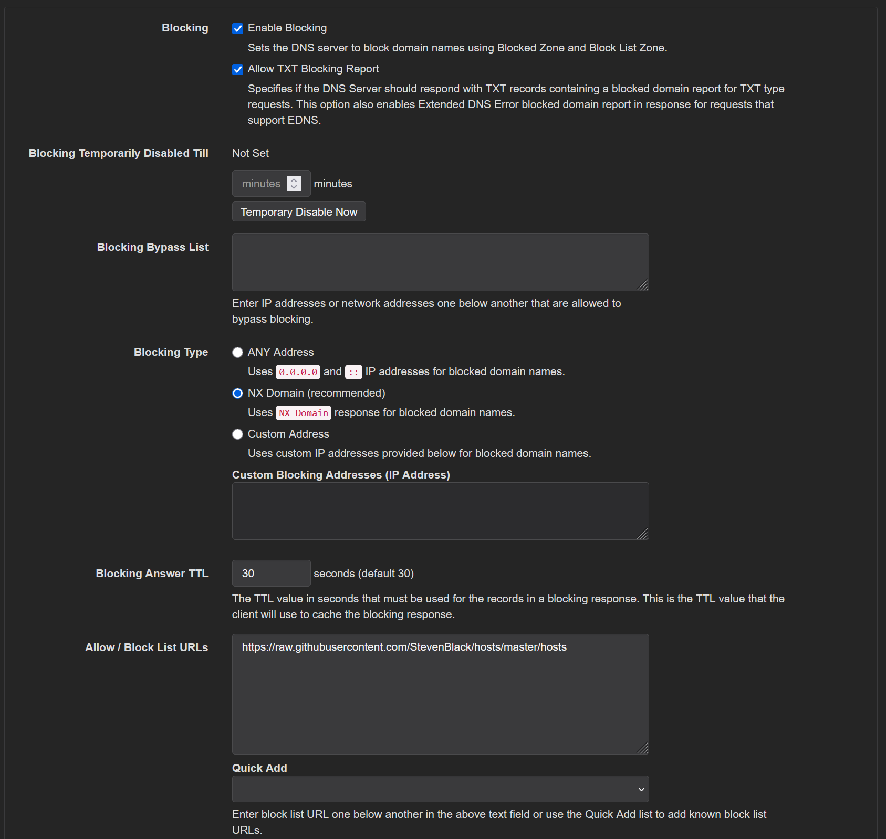

## Deploying Technitium 

These instructions presume the following: 
* You have an OPNsense instance running (required)
* You already know how/have setup a Traefik instance to reverse proxy to the UI (optional, but advised)
* You're deploying Technitium as a Docker container on a Linux server. You can probably deploy this on Windows as well, but you'll need to make some adjustments to account for Windows' handling of Docker containers. IMO Windows isn't really suitable for something mission critical running Docker, and since Linux is free.... 
* You have domains that you use specifically for your private cloud or homelab, e.g., my-private-cloud.com that you'll use for configuring internal domains (e.g., service.local.my-private-cloud.com) that point to services that you're hosting. 

Note: when I first set this up, I had OPNsense providing DNS and DHCP and then I switched it over to Technitium. 

### Initial Deployment 

1) Generate a password for the Technitium UI and then store it as an environmental variable on the server you're deploying Technitium on. 
2) Go into OPNsense and add a static IP address assignment for the server running Technitium 
3) Create a folder at /opt/technitium to store the Technitium data 
5) Go to the [Docker compose file](compose.yaml) and "pin" the latest version of Technitium Docker container or just use what's currently there
6) Configure Traefik using the content in the [sample traefik config](sample_traefik_config.yaml) file. Due to how Technitium runs you won't be able to configure with labels in its own Docker compose the way you would with something like Portainer or Linkwarden, instead, you'll need to 
7) Run `sudo -E docker compose up -d  --force-recreate --remove-orphans` to start up Technitium
8) Go to <technitium_server_ip>:53443 to access the UI

### Firewall Configs 

Now that Technitium is setup, you need to configure OPNsense (or your Firewall) to use Technitium for DHCP an DNS. 

1) Configure DNS in OPNsense, the key item is to a) click the do not use local DNS box b) input the IP addresses of the DNS servers. This will switch your network over to using Technitium for DNS. 

    

2) OPNsense allows you to specify multiple different approaches for DNS for each interface you have available, just make sure none of them are turned on for interface that corresponds to the network that Technitium is running on. 

    

    E.g. If Technitium is running on LAN1, there shouldn't be checkbox next to it.  

### Managing Internal Domains
1) Technitium refers to your domains (e.g., my-private-cluster.com) as a "zone", go to Zones --> Add a Zone, to add a Zone for one of your domains (if needed)
2) Once you've created a zone, you can add subdomains in the UI via Zones --> Domain name (e.g. example.com) --> Add Zone and then type in the sub-domain name as per the below:

#### Automation & IAC for Zones & Local Domains
You can also upload with zone information in them to either add sub-domains or create a zone. You can find more details in the [automation section](../setup_automation/zones/READMD.md)

### DHCP 

1) Go to DHCP --> Scopes --> Add Scope to configure IP address ranges and DNS servers. 
    * Here you can specify the IP address ranges. For the domain name put the same domain as is being used by your firewall. Note: this is the same domain you should use when creating a Technitium cluster. On this page (near the bottom) can also set side ranges of IPs that won't be dynamically assigned (i.e., reserved for static assignments), etc. Once you've created a scope, you can go back and click the edit button to add static IP addresses. 

    * Add DNS Server IPs - while not needed if you have just one DNS server, I would still uncheck the box and add the IP of the server Technitium is running on, just makes it easier when you add additional DNS servers in the future. 

2) Go to Settings --> General and put in the server's IP as the DNS server source IP similar to the below 

    
    This controls the source IP for your DNS server's outgoing requests

3) In the [Setup Automation](../setup_automation/dhcp/README.md) folder, there is is an example of how you can use the API and CSV file to bulk upload DHCP reservations. 

### DNS Filtering & Security 

1) DNS Filtering (optional, but highly recommended): presumably you'll want to enable DNS filtering/blocking of domains used for mischief and tracking. Go to Settings --> Blocking to enable this capability  

    

### On-going maintenance

Technitium has an API that allows you to configure domain names and DHCP without having to go through the UI, e.g., you could use a python script and csv file to upload your list of domains from a CSV file, ditto for the static leases. 