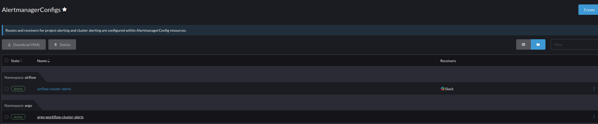
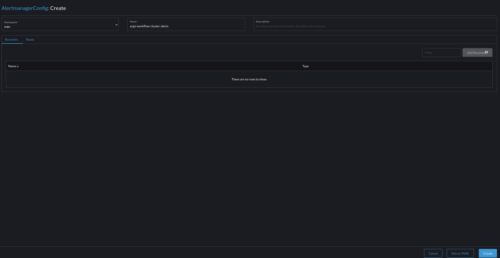
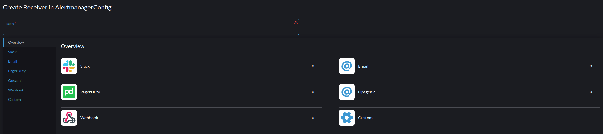
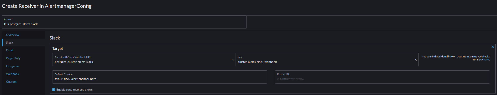
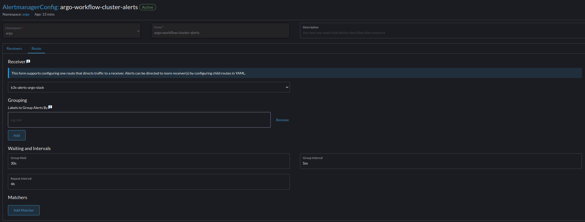

## Setting up Alert Manager

Alert monitor is included as part of the Kube-Prometheus stack, but there are a couple of extra steps if not "gotchas" you need to take care of to get everything working properly

#### Pre-requisite(s): 

1) Configure a Slack webhook to receive alerts (I use Slack as it's the easiest to setup). Just Google "Slack API", their documentation is great and easy to follow so you shouldn't have any issues. TL/DR: you're going to create a Slack channel to receive the alerts and then a webhook that allows you to ping that channel. 
2) Create a secret containing the webhook in each and every namepace you want to receive alerts for. Tip: create the first secret and then click the hamburger menu and select "clone" to copy it over to the other namespaces.

#### Setting up alerts

1) The first step is to create an alert config: go into the left hand menu: Monitoring --> Alerting --> AlertmanagerConfigs. Ignore Routes & Receivers, it's been deprecated. You'll see a screen like the below, click "Create"

2) Input the name of the config and click create. For some odd reason you can't configure the receiver and route until you create the config, would be great if you could do it all at once. 

3) Now that you've created a config you can use the Slack secret you created earlier to configure a receiver or destination for the alerts, you'll just go back to the screen from step one and click the name of the config you just created. 

4) In the receivers section/tab select "Add Receiver", on the following page click "Slack", on the following page click "add Slack" 

5) On the next page under Target add a name for the receiver, use the drop down to select the name of the secret with your Slack Webhook(s) and then select the key for the webhook. Additionally, you can also choose to click "Enabled send resolve alerts", so you can get an alert when a problem is resolved. Once you're satisified with how the receiver is configured click "Create" in the bottom left hand corner, which will take you back to the "AlertmanagerConfig" page. Note: if you click "Route" on this page you won't be able to edit the route, we'll address that next. 

 

6) Click the hamburger menu in the top right hand corner and select "Edit Config", which will take you back the AlertmanagerConfig page. This is odd, but expected, click "Route" and you can now edit the Route. At minimum you have to select the receiver you created in step five. 

 

You can also add labels so that your alerts for related issues are grouped together, think: a node goes down and several services generate alerts, you don't neccesarily want to see each alert but it would be good if you can see all the affected services.

Once you have your alerts setup click monitoring in the left hand side menu, and then click the "PrometheusRules" icon on the right hand side of your screen, this will show you all the rules that are pre-configured. 

*Note: if you click monitoring --> advanced --> "PrometheusRules" you won't see any rules, I believe this is where you go to create new ones + special rules that can calculate a value based on incoming data and then send that out as an alert. I.e., I just focus on the other set of rules and haven't had a need for this screen, but will update the docs when I do.* 

One more item, in the right portion of the screen when you're using Rancher there will be a drop down that says "Only User Namespaces", select system and cluster resources from it so you can create the Slack webhook secret for those namespaces and then configure alerts. 

Once the alerts are configured, test them out, by, well, intentionally causing problems (I unplugged a node that wasn't currently running anything) and see what generates alerts and what doesn't. Note: that most of alerts don't fire right away, as the system generally waits to ensure that the issue is worth pinging you over/will resolve itself. From there you can gather information to edit your alerting configuration, add alerts, rules, etc. For the record I bake Slack alerts into my custom containers, so I'm mostly using this functionality for dedicating hardware problems or service wide issues. E.g., PostgreSQL stops working, nodes go offline, etc.