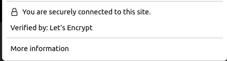

## Setting Up pfSense 

This document presumes you already have pfSense installed and running, are somewhat familiar with networking and are looking to configure some of the more advanced features. Topics covered in this document will include:
* Configuring alerting via Slack [DONE]
* Adding Secure Certificates via letsencrypt.org and Cloudflare [DONE]
* Writing data to InfluxDB via Telegraf [PENDING]

### Slack Alerts 

Note: this presumes you've already signed up for the Slack API, are familiar with configuring webhooks, etc. If you're not, just go to the web site for the [Slack API](https://api.slack.com/), sign-up, create a Slack channel to receive the alerts, create an app and then get an API key. 

1) Go to System --> Advanced --> Notifications 
2) Scroll to the bottom of the page and add the API key and the name of your slack channel
3) Click the box to enable Slack notifications 
4) Click the icon to test the connection 

Once this is setup you'll get alerts for pretty much any issue that occurs with your firewall:
* Rebooting
* Issues with installed packages or their patches 
* Pretty much anything that would generate an alert

IF you want to go beyond that, you'll need to: 
 1) setup logging/monitoring via something like Telegraf or Prometheus
 2) configure specific alerts within a tool like Grafana or Prometheus alert manager. 

### Adding Secure Certifications via LetsEncrypt.org & Cloudflare

**If you've set up pfSense I'm assuming you did it to take an active role in managing your home network security, and I don't *need* to say this, but I'm going to say it anyway: use these steps at your own risk, triple check everything, and continually monitor and research how to improve your security, especially if you want to host services that are accessible outside your network.**

Note(s): 

* You don't sign up directly with letsencrypt.org, you instead utilize the service as a backend to other tools/services you use to secure your connections. In this particular case that means Cloudflare and Acme. 
* I had to piece the together the below from blogs, pfSense documentation and the like. I'm hoping this makes this process easier for someone. I will say that I double checked this setup and it worked as of Feb '24, so if you're too far from that date, YMMV.  

1) If you haven't already done so, go to Cloudflare and setup an account, register a domain (or transfer an existing one).  
2) Under overview you can navigate to getting your API key - make note of that for later
3) Go to System --> Package Manager --> Available Packages and install ACME (Automated Certificate Management Environment)
4) Go to System --> Acme and then select the "Account Keys" tab and then click "add new"
5) Fill out the form, click "Create new account key" and "Register ACME account key", click save and then go to the certificates tab. 
    * Note: make sure you follow the instructions around using the Letsencrypt staging environment first, as you only request five or so certificates from production per week and if you try to request more, you'll get locked out for several days. Once you've verified things worked, you'll come back to this page and do it again with the production endpoint. 
6) Click the add button to add a new certificate, and here is where things can be get a little tricky, in particular under Domain SAN list:
    * Click Add
    * In the box to the right of "Enabled" put the domain you're going to secure on your **HOME** network, meaning: local.yourdomain.com with your domain being the domain we registered with Cloudflare in the first step, then enter your Cloudflare email address, and the API token I asked you make note of 
    * Next, add a second entry that's identical to the one above, only it should be *.local.yourdomain.com. This is necessary to create "wildcard" certificates so that you can create domains like pfsense.local.markhamslab.com to point to your pfSense UI and the browser will see that it's properly secured, ditto for other services you deploy on your home network. 
7) Click save, don't click the "Issue/Renew" button, we'll come back to that later. Instead, go to 
general settings and configure things as you wish. 
8) Go to services --> DNS resolver
9) scroll down the bottom of the page to the "Host Overrides" section. You'll want to create a local domain address for your pfSense firewall. E.g., pfsense.local.yourdomain.com
    * host = what you'd enter before local.yourdomain.com
    * Domain = local.yourdomain.com 
    * IP address is the IP you're using to access pfSense 
10) Click save and the page will refresh, be sure to click the "apply changes" message at the top of the page. 
12) Go to Firewall --> NAT and then on the port forward tab, set up a role to route port 80 traffic to port 80 traffic on your pfSense IP address
13) Go back to Acme --> Certicates click "Issue/Renew", the gear will turn and eventually you'll get a large message (green text) that will show the status of your request, read through it and make sure there aren't any errors you need to address. 
14) Go to system --> advanced and the "Admin Access" tab:
    1) Make sure the "HTTPS(SLS/TLS) box is checked
    2) Under SLS/TLS certificate select the one you just created
    3) Under "Alternate Hostnames" type in the local domain you created in step 9
15) Go to System --> Certificates and then the certificates tab, you should see your new cert and under the "In Use" column you should see "webConfigurator, DNS Resolver". If some reason you don't, doublecheck the prior step. 
    * Note: you should also see the self-signed cert created when you first step pfSense, I just deleted it once I had Acme setup. 
16) Once things look good, go to Services --> Acme --> Certificates to generate a production cert. Just click "Add" and make sure to select: "encryption-key-lets-encrypt-prodution" under "Acme Account" and then fill things out as as you did in step #6. 
17) Go to the System --> Advanced and selet the production cert 
18) reboot 
19) Test things work via the host you created for pfSense + local.yourdomain.com e.g., pfsense.local.yourdomain.com 
20) If things don't work double check the SAN config and the host overrides in step #9 I.e., that's where I messed up. Also double check system --> certificates --> certificates and make sure that under "In use" you see "webConfigurator DNS resolver ACME" for the production cert 
21) When you're sure things work, turn off the routing rule (step #12), you only need it for certificate renewals 

When things are setup right, you should see the following when you access your router and then click the lock icon in your browser's address bar: 

Also - if you change your firewall's domain or add additional ones for internal hosting, you'll probably have to reboot your router for things to show up correctly in your browser.

