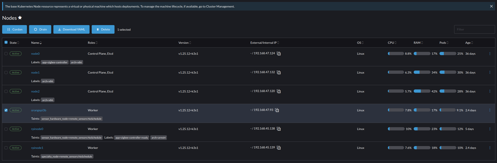

## Basic setup with Ansible 

* Honestly, just use [Techno Tim's playbook for the basic setup](https://www.youtube.com/watch?v=CbkEWcUZ7zM&t=316s), you'll save yourself a LOT of headaches, plus learning ansible will payoff later on. 

#### A couple of tricks to make it go smoother after you've cloned Tim's repo but BEFORE you run any commands: 

##### Preparing your environment to run the playbook: 
* Make sure you have an up to date version of python installed, including pip and virtual environments. 
* Install Ansible on your machine but make sure you follow this process, as chances are your Linux distro installed an older one. This is the process I followed:
    * Check your Ansible version, the instructions say at least 2.11, FWIW I had 2.16 installed on mine. If you're above 2.11, you're good, if not, follow the next step(s):
    * Remove the old version: 
        * sudo apt remove ansible 
        * sudo apt --purge autoremove 
    * sudo apt update 
    * sudo apt upgrade
    * Run the following commands to install PPA support + add teh ansible repo
        * sudo apt -y install software-properties-common
        * sudo apt-add-repository ppa:ansible/ansible
    * Install ansible: sudo apt install ansible 
* Create a python virtual environment and install Ansible directly into it:
    * python3 -m pip install ansible
* You may or may not get an netaddr error, so you go ahead and install that into your virtual environment. 
* Now install the requirements.txt file that came with the repo into your virtual environment
* **Optional Steps:**
    * You'll need some additional server arguments to get things setup to fully use monitoring, see them below. I got these from [Tim's Video on setting up the kube-prometheus-stack](https://www.youtube.com/watch?v=fzny5uUaAeY&t=119s), using these server arguments when you first get things setup will just make things easier whether you follow Tim's instructions or just use the kube-prometheus add-on that's already in Rancher to deploy the monitoring stack. 

```
extra_server_args: >-
  {{ extra_args }}
  {{ '--node-taint node-role.kubernetes.io/master=true:NoSchedule' if k3s_master_taint else '' }}
  --tls-san {{ apiserver_endpoint }}
  --disable servicelb
  --disable traefik
  --kube-controller-manager-arg bind-address=0.0.0.0
  --kube-proxy-arg metrics-bind-address=0.0.0.0
  --kube-scheduler-arg bind-address=0.0.0.0
  --etcd-expose-metrics true
  --kubelet-arg containerd=/run/k3s/containerd/containerd.sock
    
```
    Make sure you get the copy and paste perfect, right down to indentations, irritating things can happen otherwise. 

##### Preparing your hardware 
* Make sure you turn off swap on all your devices
* Turn off the Ubuntu firewall or at least open all the relevant ports for K3s 
    * I turned it off as I already have a firewall for my home network in place 
* Install openssh so the machines can talk to each other 
* Install venv for python virtual environments
* Set up all your devices for passwordless SSH between them by exchange SSH keys and quadruple check this before you run the playbook. 
* On the device you're going to run the playbook from set that one up for passwordless SSH with itself. I know it sounds goofy, but it can hang otherwise as Ansible connects to the host via SSH. FTR it will often just connect and run fine, but if it doesn't.. 

##### Other Tips 
* The playbook is solid, at least it has been for me, chances are if you run into some issues it's with your ansible installation: 
* If you get a jinja error noting a filter isn't available, you're using an older version of ansible and that's likely from your Linux distro intalling an older one - see the instructions for updating Ansible version above  
* If the script runs and won't connect, doublecheck your server arguments, I'd copy and paste the original ones from the repo and see if those work... don't ask how I know. 

##### Adding and removing hardware 
* Adding hardware is easy, just add setup the device like you did for the initial ones in your cluster and then add its IP address to the hosts.ini file and then re-run the playbook. 
* Removing hardware, requires the following steps:
    * Create a duplicate of the directory that has your ansible playbook. The goal is to have a playbook that's just for adding nodes and one that's just for removing them. Adding and removing from the same playbook, can easily go sideways. 
    * Next create a copy of the hosts.ini and call it "clean.ini" 
    * Remove ALL ip addresses from the hosts.ini file. This will ensure that the reset operations you run from your remove nodes directory can't accidentally take down your entire cluster. 
    * Go into Rancher, click the hamburger menu --> explore cluster --> cluster name and then click nodes on the main menu OR you can click cluster in the side menu adn then nodes. 
    * Click the checkbox next to the node you want to remove, and an option called "drain node" will appear:
    
    * Clicking drain will remove all containers, pods, deployments, etc., from the node and schedule them elsewhere (if possible).
    * Once the drain process is complete, click delete 
    * Now go back to your playbook directory that's ONLY for removing nodes and add that nodes IP address in the appropriate place of your clean.ini file. 
    * Run the reset playbook, **make sure the only IP addresses in that file are for the nodes you want to remove**. This last step is important, if you don't do this, the next time the device comes online it will just be re-added to the cluster. 

##### Updating Hardware 
* Similar to removing the node, you just select "Cordon" instead of drain and then restart the device to apply updates, shut down and upgrade the hardware, etc. 
*  To test the durability of the cluster I've randomly restarted individual nodes, turned them off, etc., and then back on and the system handles it just fine. One thing I've noticed is that the number of deployed resources spikes when that piece of hardware returns. 


#### Post Setup 
* I would experiment with building things up, resetting and building again, adding nodes, removing them, etc., and getting really comfortable with those processes before moving on to building out cluster with all the features and apps you want/need. 
* **Deploying Custom Code:** Experiment/play around with deployiing custom containers, legit containers that actually do something, don't bother experimenting with hello world or basic containers that don't represent what you want to deploy on your homelab or at work. Even if all you do is build a basic container to pull data from the cat or joke API and then send it to a slack alert, or write them to Postgres, the issues you run into will teach you a lot. So, build something legit, experiment with  moving it around to various nodes, get comfortable with defining variables and/or secrets in things like config maps, opaque secrets and the like, run into issues, fix them, repeat. 
    * Note: if you're not super familiar with Docker, taking a step back and getting comfortable with building containers, pushing them to a repo and deploying them via something like Portainer is a great way to practice and/or test before moving on to Kubernetes. 
* **Deploying Third Party Apps:** deploying things via the Rancher UI "seems" convenient and in many cases will work just fine, additionally, doing this way can be helpful in terms of knowing how to configure things. BUT, a lot of things just deploy better from the command line. Also, sometimes the charts in Rancher are out of date (e.g., Zigbee2mqtt), which can cause other issues. TL/DR: on numerous occassions I had issues getting things to deploy via using the repos in Rancher, went to deploying it from the command line and things worked just fine. 


## Things I wish I picked up sooner    
* Your certificates are at the namespace level. So if something in namespace xyz needs a cert, you need to generate one in that namespace. 
* The above being said, your ingress has a secure cert and you're using wildcard certs so you SHOULD be okay if you just setup the ingress. This appears to be working for me, but again, mileage varies. 
* In keeping with the above, SOME apps/services you can just give it the ingress class and the email you used with cloudflare and it will do the rest (see Rancher) others, not so much. 


