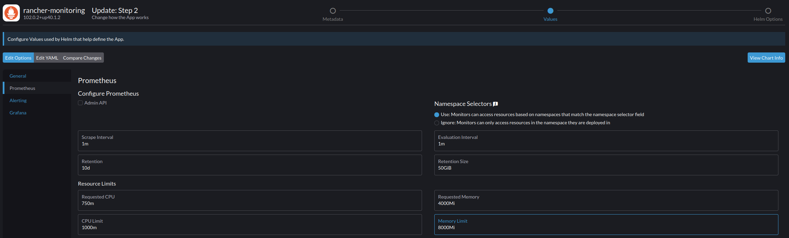

## Setting up Monitoring    

* I installed the Kube-Prometheus stack that's available in Rancher, you can reach it by going to Apps --> Charts --> Monitoring. Doing this will give you ~three dozen dashboards that you can use to monitor various aspects of your cluster. You'll also be able to drill down into individual namespaces and apps to see their resource utilization, performance, etc. 
* There are also a lot of tutorials online around setting up the Kube-Prometheus stack that you could use, but they all accomplish pretty much the same thing. I recommend this one from [Techno Tim.]((https://www.youtube.com/watch?v=fzny5uUaAeY&t=119s)). That being said, if you're using Rancher you can just follow the directions above and you should be fine. 

#### Kube-Prometheus is very resource intensive

* **Large type Caveat:** The Kube-Prometheus stack is rather resource intensive, meaning: if your nodes have 32+ GB of RAM you should be fine, but if you're using devices like a Raspberry Pi, RAM constrained nodes, etc., you're probably better off "home brewing" something using a python library like psutil. In fact, even if you have control/server nodes with a lot of Ram and add some memory constrained devices as agent nodes, you could still run into problems. I added a 4 GB Raspberry Pi as an agent node and immediately got a lot of Prometheus errors. 

* The default settings for memory probably won't work, you'll likely encounter a situation where your Prometheus container(s) keep crashing and restarting, you can remedy this by increasing the default settings for memory during setup:

**Standard Settings - Don't Use These**

**My Settings/Settings That Stopped the Container Failures**

* Reserving 4GB for a monitoring solution and setting the limit at 8GB to monitor three devices looks and feels like overkill, but that's what kept the container from constantly crashing and the metrics only working maybe 1/3 of the time. I know Kubernetes is complex and there is a lot going on behind the scenes, but it still seems excessive. 
* At some point I'm going to see if I can put something together that's more resource efficient and/or just gathers data on a much smaller array of metrics. On another project I gather hardware data using the psutil library and it barely registers resource wise, think less than 1% CPU and under 20 MB of RAM. Again, Prometheus is monitoring any and all Kubernetes activity and not just CPU, GPU and RAM activity, but it still seems excessive. 
