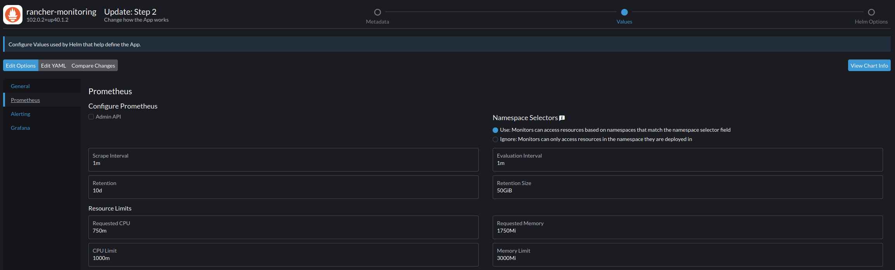

## Setting up Monitoring    

### Caveat: Kube-Prometheus is very resource intensive

The Kube-Prometheus stack is rather resource intensive, so if you're running nodes with less than 8 GB of ram you're likely to run into issues. The issue isn't so much how much RAM is being used (which is often small as far as Prometheus is concerned), but the node's available resources vs the minimum request size required for the Prometheus to work (more on that below). Meaning 4GB Raspberry Pi or similar devices won't work as the minumum request size is about 4 GB, so you'll you need at devices that have at least 8 GB, otherwise the RAM request size will exceed the node's resources. That being said, the 4 GB node will still work IF you have other nodes with sufficient resources, but you're going to get a lot of error alerts. 

*TL/DR your nodes need at least 8 GB or RAM and it should really be 16 GB, Prometheus won't use anywhere near that much, but if it's not available you'll run into issues.*

### Installation

The Kube-Prometheus stack is well integrated into Rancher, so all you really need to do is go to Apps --> Charts and click on the monitoring Icon for the Kube-Prometheus Stack. However, to get everything to work there are a couple of small changes you'll need to make to the default configuration: 

* You'll need to update your RAM resource settings, as the default settings (for three nodes mind you) didn't work and the Prometheus container kept crashing: 

**Standard Settings - Don't Use These**


On the screen you above can change the settings in the UI, but there is an additional setting you need to change for alert manager to work properly so click "Edit Yaml"

The first setting you'll want to change is the # of replicas for Alert Manager, you need to have one for every server/control node or your cluster status will show up as "disabled" in Alert Manager. 

```
alertmanager:
  alertmanagerSpec:
    additionalPeers: []
    affinity: {}
    alertmanagerConfigNamespaceSelector: {}
    alertmanagerConfigSelector: {}
    alertmanagerConfiguration: {}
    clusterAdvertiseAddress: false
    configMaps: []
    containers: []
    externalUrl: null
    forceEnableClusterMode: false
    image:
      repository: rancher/mirrored-prometheus-alertmanager
      sha: ''
      tag: v0.24.0
    initContainers: []
    listenLocal: false
    logFormat: logfmt
    logLevel: info
    minReadySeconds: 0
    nodeSelector: {}
    paused: false
    podAntiAffinity: ''
    podAntiAffinityTopologyKey: kubernetes.io/hostname
    podMetadata: {}
    portName: http-web
    priorityClassName: ''
    replicas: 3 # change this to the number of control nodes in your cluster
```
Next you'll want to scroll down to resources in the prometheus section:

```
prometheus:
  prometheusSpec:
    resources:
      limits:
        cpu: 1000m
        memory: 8000Mi
      requests:
        cpu: 750m
        memory: 4000Mi
```
Change memory under requests to "4000Mi" and "8000Mi" under limits. I did try smaller levels once I got things working with these resource limits, and the containers always crashed. 

NOTE: if you update this deployment the resource values will go back to their default levels regardless if you set them in the YAML or the via the UI (at least that's been my experience), SO, make sure you update those values if you change the configuration and redepoy. I.e., if you make config changes and Prometheus starts crashing, the values going back to the old levels are probably the culprit. 

Finally, make sure you have persistence enabled for Grafana, if you want to have multiple instances of Grafana running make sure you change "accessModes" to "ReadWriteMany". 

```
  persistence:
    accessModes:
      - ReadWriteOnce
    annotations: null
    enabled: true
    finalizers: null
    size: 2Gi
    storageClassName: longhorn
    subPath: null
    type: pvc
```

Once you've made the changes to replicas for alert manager and resources for Prometheus, you should be good to go. 

Doing this will give you ~three dozen dashboards that you can use to monitor various aspects of your cluster. You'll also be able to drill down into individual namespaces and apps to see their resource utilization, performance, etc. 
* There are also a lot of tutorials online around setting up the Kube-Prometheus stack that you could use, but they all accomplish pretty much the same thing. I recommend this one from [Techno Tim.]((https://www.youtube.com/watch?v=fzny5uUaAeY&t=119s)). That being said, if you're using Rancher you can just follow the directions above and you should be fine. 

### Final Thoughts

* Setting RAM requests to 4GB and the limit at 8GB seemed like overkill when I first built the cluster, but as I use Prometheus for more and more things related to alerts, logging, monitoring specific apps, etc., I'm starting to think it's just unavoidable given how much data the solution is pulling together. I.e., the more I work with the cluster, the less I'm interested in a monitoring solution that "does less".
* The above being said, I'm still interested in possibly building a cluster with lower powered machines using less than 4 GB of RAM for potential edge/IoT sensor use cases, so in those cases I may just limit monitoring to container logs for each workload + using something like Psutil to monitor the hardware if I can't find a lightweight Prometheus alternative.